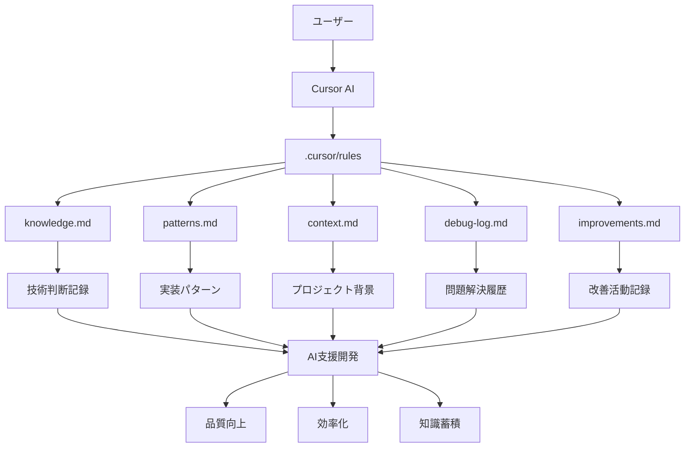

# Cursor Knowledge Management System

Cursor AIの`.cursor/rules`形式に対応した知識管理システムです。AI支援開発における一貫性、品質向上、そして効率的な知識蓄積を実現します。

## ✨ 主な特徴

- **🎯 .cursor/rules対応**: Cursor AI公式の`.cursor/rules`形式を採用
- **🔄 自動適用**: 手動設定不要の自動化されたルール適用
- **📚 体系的管理**: プロジェクト知識の構造化された管理
- **🚀 セットアップ**: 導入後の活用開始
- **👥 チーム対応**: 個人からチーム開発まで対応

## 🚀 クイックスタート

### 1. リポジトリのクローン
```bash
git clone https://github.com/shioki/Cursor-Knowledge-Management-System.git
cd cursor-knowledge-management-system
```

### 2. テンプレートをプロジェクトにコピー
```bash
# Windows (PowerShell)
Copy-Item -Path "templates\.cursor" -Destination ".cursor" -Recurse
Copy-Item -Path "templates\.cursorignore" -Destination ".cursorignore"

# Mac/Linux
cp -r templates/.cursor .cursor
cp templates/.cursorignore .cursorignore
```

### 3. 必須ファイルの更新
**⚠️ 重要**: 以下のファイルを実際のプロジェクト情報で更新してください：
- `.cursor/knowledge.md` - 技術判断の記録
- `.cursor/patterns.md` - プロジェクト固有のパターン
- `.cursor/context.md` - プロジェクト背景・制約

## 📚 ドキュメント

### 🚀 Getting Started
- **[クイックスタート](docs/getting-started/quick-start.md)** - 5分で始める導入手順

### 📋 Templates
- **[テンプレート概要](docs/templates/overview.md)** - テンプレートの概要とナビゲーション
- **[Context ガイド](docs/templates/context-guide.md)** - プロジェクト情報の記載方法
- **[Patterns ガイド](docs/templates/patterns-guide.md)** - 共通パターンの記録方法
- **[Knowledge ガイド](docs/templates/knowledge-guide.md)** - 技術的知見の蓄積方法
- **[Debug ガイド](docs/templates/debug-guide.md)** - 問題解決の記録方法
- **[Improvements ガイド](docs/templates/improvements-guide.md)** - 改善活動の記録方法

### 🏢 Advanced
- **[チーム導入ガイド](docs/advanced/team-implementation.md)** - チーム全体での活用方法

### 📖 Reference
- **[完全ガイド](docs/cursor-knowledge-management-system.md)** - システムの詳細説明
- **[開発ログ](docs/reference/development-log.md)** - システム開発の記録
- **[MCP日時設定ガイド](docs/reference/mcp-datetime-setup.md)** - MCPサーバの設定方法

## 🏗️ システム構成



## 📁 プロジェクト構造

```
cursor-knowledge-management-system/
├── templates/.cursor/           # 🔥 テンプレートファイル（コピー用）
│   ├── knowledge.md            # 技術判断記録テンプレート
│   ├── patterns.md             # 設計パターンテンプレート
│   ├── context.md              # プロジェクト背景テンプレート
│   ├── debug-log.md            # デバッグログテンプレート
│   ├── improvements.md         # 改善記録テンプレート
│   └── rules/                  # .cursor/rulesテンプレート
│       ├── knowledge-management.mdc
│       ├── project-context.mdc
│       ├── debug-workflow.mdc
│       ├── debug-support.mdc
│       ├── improvement-tracking.mdc
│       ├── patterns-library.mdc
│       └── team-standards.mdc
├── templates/.cursorignore      # Cursor無視ファイル設定テンプレート
├── docs/                       # ドキュメント
│   ├── getting-started/        # 導入ガイド
│   ├── templates/              # テンプレート使用ガイド
│   ├── advanced/               # 高度な使用方法
│   └── reference/              # 技術リファレンス
└── README.md                   # プロジェクト説明

# 導入後の実際のプロジェクト構造:
your-project/
├── .cursor/                    # ← templates/.cursor/ をここにコピー
│   ├── knowledge.md           # 実際のプロジェクト情報で更新
│   ├── patterns.md            # 実際のプロジェクト情報で更新
│   ├── context.md             # 実際のプロジェクト情報で更新
│   ├── debug-log.md           # 実際のプロジェクト情報で更新
│   ├── improvements.md        # 実際のプロジェクト情報で更新
│   └── rules/                 # .cursor/rules（Cursorが認識）
├── .cursorignore              # ← templates/.cursorignore をここにコピー
├── src/                       # あなたのプロジェクトファイル
└── README.md                  # あなたのプロジェクト説明
```

## 🎯 使用例

### 基本的な知識記録
```markdown
# .cursor/knowledge.md に記録
## 設計判断の記録

### 2024-01-15 - API設計方針
#### 判断内容
REST vs GraphQL の選択

#### 決定内容と理由
**決定**: REST API を採用
**理由**: 
- チームの習熟度が高い
- プロジェクトの複雑さに適している
- 開発期間の制約を考慮
```

### 自動参照の確認
AIとの対話で以下のように参照されることを確認：
```
@.cursor/knowledge.md @.cursor/patterns.md
「ユーザー認証機能を実装してください」
```

## 🔧 システム要件

- **Cursor AI**: 最新版推奨
- **Node.js**: 18.x以上（MCPサーバ使用時）
- **Git**: 2.0以上

## ✅ 品質チェック（推奨）

- **リンクチェック**: `npx markdown-link-check README.md CHANGELOG.md docs/**/*.md`（CIでは `--quiet` 併用推奨）
- **.mdc frontmatter検証**: `description/globs/alwaysApply` の必須キー有無をスクリプトで確認（例: `scripts/check-mdc-frontmatter.mjs`）
- **実行タイミング**: 週次ドキュメント更新時・リリース前に実施

## 📄 ライセンス

MIT License - 詳細は [LICENSE](LICENSE) ファイルを参照

## 🤝 貢献

このプロジェクトへの貢献を歓迎します。詳細は [開発ログ](docs/reference/development-log.md) を参照してください。

---

**⚠️ 重要**: このシステムを効果的に活用するには、`.cursor/`内のファイルを実際のプロジェクト情報で更新することが必須です。

---

**📅 最終更新**: 2025-12-07  
**📋 バージョン**: 2.0.1  
**📝 変更履歴**: [CHANGELOG.md](CHANGELOG.md) を参照