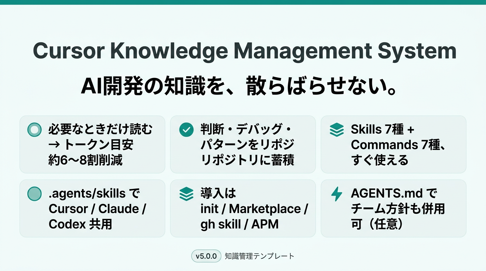
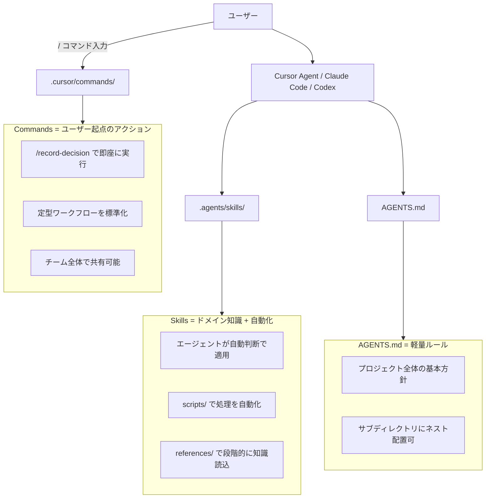

# Cursor Knowledge Management System

Cursor AI のエージェントスキル（Agent Skills）とカスタムコマンド（Commands）を活用した知識管理システムです。AI 支援開発における一貫性、品質向上、そして効率的な知識蓄積を実現します。

> **v5.0.0**: **Cursor Plugin として配布可能**な構成に刷新。`.agents/skills/` 正規ディレクトリへ移行し、**init / Cursor Marketplace / `gh skill` / Microsoft APM** の **4 つの配布経路**をサポートします。`AGENTS.md` テンプレートも同梱。
> - 新規: [Cursor Plugin 開発ガイド](docs/advanced/plugin-development.md)
> - 新規: [Marketplace 提出手順](docs/reference/marketplace-submission.md)
> - 新規: [gh skill 連携](docs/reference/gh-skill-integration.md)
> - 新規: [APM 連携](docs/reference/apm-integration.md)
> - 新規: [AGENTS.md 運用ガイド](docs/getting-started/agents-md-guide.md)
> - 破壊的変更と移行手順: [RELEASE_NOTES_v5.0.0.md](RELEASE_NOTES_v5.0.0.md)

## 特徴インフォグラフィック

**v5.0.0 の要点**を一枚にまとめた PNG です（構造図ではなく、ベネフィットと導入のしやすさにフォーカス）。



図の読み方は次のとおりです。

| 観点 | 一言 |
|------|------|
| **トークン** | スキルは文脈に合わせて選択的に読み込み、ベースラインの目安は従来ルール比で約 6〜8 割削減 |
| **知識** | 技術判断・デバッグ・パターンなどをプロジェクト内に残す |
| **すぐ使う** | プリセットの Skills 7 種と `/` Commands 7 種 |
| **互換** | `.agents/skills/` を軸に、Cursor / Claude Code / Codex で共用 |
| **導入** | init・Marketplace・`gh skill`・APM のいずれか（または併用） |
| **ルール** | `AGENTS.md` は任意で、チームの基本方針と併用可能 |

## なぜ Skills + Commands なのか

従来の `.cursor/rules` では `alwaysApply: true` のルールが毎回すべてのリクエストに含まれ、globs マッチしたルールも関連性に関わらず読み込まれていました。知識ファイルも一括で渡されるため、**実際には不要なトークンが大量に消費**されていました。

Agent Skills では、エージェントが会話の文脈から必要なスキルだけを自動選択し、詳細情報は **references/ からオンデマンドで段階的に読み込み**ます。SKILL.md 本体は軽量に保たれるため、**トークン消費とコストを大幅に削減**できます。さらに scripts/ によるタスク自動化、`/` コマンドによるワークフロー即時起動により、知識を蓄積する習慣のハードルも下がります。

### トークン消費の目安

| 項目 | 旧（rules） | 新（skills） |
|------|-------------|-------------|
| **リクエストごとのベースライン** | ~2,000-4,000 tokens | ~300-800 tokens |
| 内訳: 常時読み込み | alwaysApply ルール全文（毎回） | スキルの description 一覧のみ |
| 内訳: 条件読み込み | globs マッチしたルール全文 | 文脈に合うスキルだけ選択的に |
| 内訳: 知識データ | @参照で対象ファイル全文 | references/ を必要時にオンデマンド |
| **削減率の目安** | - | **約 60-80% 削減** |

> **注**: 実際の削減率はプロジェクトの知識量、ルールの数、利用頻度により異なります。
> 知識ファイルが大きいプロジェクトほど削減効果が高くなります。

詳しい背景は [v2.x からの移行ガイド](docs/getting-started/migration-from-rules.md) を参照してください。

Cursor は [プラグイン](https://cursor.com/ja/blog/marketplace)（MCP・スキル・ルールなど）で拡張できます。本テンプレートは「スキル＋コマンド」を提供する Cursor Plugin として、必要に応じて [Cursor Marketplace](https://cursor.com/ja/blog/marketplace) の他のプラグインと組み合わせて利用できます。

## 主な特徴

- **Cursor Plugin 対応**（v5.0.0）: [.cursor-plugin/plugin.json](.cursor-plugin/plugin.json) による Marketplace 配布に対応
- **`.agents/skills/` 公式ディレクトリ**（v5.0.0）: Cursor 3.x / Claude Code / Codex の公式標準に準拠。`.claude/skills/` / `.cursor/skills/` との後方互換も維持
- **gh skill / Microsoft APM 互換**（v5.0.0）: 個別スキルの `gh skill install` や `apm install` による導入が可能
- **AGENTS.md テンプレート**（v5.0.0）: ルート用・ネストサブディレクトリ用のテンプレートを同梱
- **エージェントスキル対応**: Cursor AI 公式の Agent Skills 標準仕様を採用
- **カスタムコマンド搭載**: `/` コマンドで即座に知識管理ワークフローを起動
- **自動化スクリプト**: シェルスクリプトによる記録作成・検索の自動化
- **段階的読み込み**: references/ による効率的なコンテキスト管理
- **チーム対応**: 個人からチーム開発まで対応

## クイックスタート

本システムは **4 つの配布経路** をサポートしています。好みに応じて選択してください。

### 1. init.sh（従来方式 / 推奨）

```bash
git clone https://github.com/shioki/Cursor-Knowledge-Management-System.git
cd Cursor-Knowledge-Management-System

# v5 デフォルト: .agents/skills に配置（Cursor 3.x / Claude Code / Codex 共用）
bash templates/.agents/skills/project-setup/scripts/init.sh /path/to/your-project

# AGENTS.md テンプレートも同時に配置
bash templates/.agents/skills/project-setup/scripts/init.sh /path/to/your-project --with-agents-md

# v4.x 互換（.claude/skills に配置）
bash templates/.agents/skills/project-setup/scripts/init.sh /path/to/your-project --legacy-claude

# Cursor のみ（.cursor/skills に配置）
bash templates/.agents/skills/project-setup/scripts/init.sh /path/to/your-project --cursor-only
```

Windows では同じディレクトリの `init.ps1` を利用できます:

```powershell
.\templates\.agents\skills\project-setup\scripts\init.ps1 -TargetPath "C:\path\to\your-project" -WithAgentsMd
```

### 2. Cursor Marketplace（Plugin）

Cursor 3.x 以降で公開されている Marketplace からプラグインとしてインストールできます。提出手順は [docs/reference/marketplace-submission.md](docs/reference/marketplace-submission.md) を参照。

ローカルテスト方法は [docs/advanced/plugin-development.md](docs/advanced/plugin-development.md) を参照。

### 3. gh skill（個別スキル単位）

GitHub CLI でリポジトリ内の個別スキルを直接インストールできます:

```bash
# 最新版
gh skill install shioki/Cursor-Knowledge-Management-System knowledge-management --agent cursor

# タグ固定版（サプライチェーン保全）
gh skill install shioki/Cursor-Knowledge-Management-System knowledge-management --agent cursor --pin v5.0.0
```

詳細: [docs/reference/gh-skill-integration.md](docs/reference/gh-skill-integration.md)

### 4. Microsoft APM（バンドル単位）

`apm.yml` 宣言で依存関係として取り込めます:

```yaml
dependencies:
  apm:
    - shioki/Cursor-Knowledge-Management-System#v5.0.0
```

```bash
apm install
```

詳細: [docs/reference/apm-integration.md](docs/reference/apm-integration.md)

### 手動コピーも引き続き可能

```bash
# Mac/Linux
cp -r templates/.agents/skills /path/to/your-project/.agents/skills
cp -r templates/.cursor/commands /path/to/your-project/.cursor/commands
cp templates/.cursorignore /path/to/your-project/.cursorignore
mkdir -p /path/to/your-project/.agents/debug-sessions
find /path/to/your-project/.agents/skills -name "*.sh" -exec chmod +x {} \;
```

```powershell
# Windows (PowerShell)
Copy-Item -Path "templates\.agents\skills" -Destination "/path/to/your-project\.agents\skills" -Recurse
Copy-Item -Path "templates\.cursor\commands" -Destination "/path/to/your-project\.cursor\commands" -Recurse
Copy-Item -Path "templates\.cursorignore" -Destination "/path/to/your-project\.cursorignore"
New-Item -ItemType Directory -Path "/path/to/your-project\.agents\debug-sessions" -Force
```

詳しくは [クイックスタート](docs/getting-started/quick-start.md) を参照。

### 初期カスタマイズ

コピー後、以下のコマンドでプロジェクト情報を設定してください:

1. `/update-context` - プロジェクト基本情報を記入
2. `/record-decision` - 最初の技術判断を記録
3. team-standards スキルの `SKILL.md` をプロジェクトの規約に更新

## システム構成

v5.0.0 では `.agents/skills/` が正規ディレクトリとなり、Cursor 3.x / Claude Code / Codex の公式読み込み対象から参照されます。


```mermaid
graph TB
    User[ユーザー] --> Agent[Cursor Agent / Claude Code / Codex]

    Agent --> Skills[".agents/skills/"]
    Agent --> AgentsMd["AGENTS.md"]
    User -->|"/ コマンド入力"| Commands[".cursor/commands/"]

    subgraph skillsArea ["Skills = ドメイン知識 + 自動化"]
        S1["エージェントが自動判断で適用"]
        S2["scripts/ で処理を自動化"]
        S3["references/ で段階的に知識読込"]
    end

    subgraph commandsArea ["Commands = ユーザー起点のアクション"]
        C1["/record-decision で即座に実行"]
        C2["定型ワークフローを標準化"]
        C3["チーム全体で共有可能"]
    end

    subgraph agentsMdArea ["AGENTS.md = 軽量ルール"]
        A1["プロジェクト全体の基本方針"]
        A2["サブディレクトリにネスト配置可"]
    end

    Skills --> skillsArea
    Commands --> commandsArea
    AgentsMd --> agentsMdArea
```

### スキル・コマンド・AGENTS.md の役割分担

| 観点 | Skills | Commands | AGENTS.md |
|------|--------|----------|-----------|
| **起動方法** | エージェントが自動判断 or `/skill-name` | ユーザーが `/command-name` で明示起動 | エージェントが常時参照 |
| **複雑さ** | 高（scripts, references） | 低（Markdown ファイル 1 つ） | 低（Markdown 1 つ） |
| **用途** | ドメイン知識の提供、自動化処理 | 定型アクション、ワークフロー手順 | プロジェクト全体のベース指示 |
| **配置** | `.agents/skills/*` | `.cursor/commands/*.md` | ルート or サブディレクトリ |

## プロジェクト構造

```
cursor-knowledge-management-system/
├── .cursor-plugin/                 # Cursor Plugin マニフェスト（v5.0.0）
│   └── plugin.json
├── apm.yml                         # Microsoft APM マニフェスト（v5.0.0）
├── templates/
│   ├── .agents/skills/             # 正規スキルテンプレート（v5.0.0）
│   │   ├── project-context/        # プロジェクト背景・制約
│   │   ├── team-standards/         # チーム開発標準
│   │   ├── knowledge-management/   # 技術判断記録
│   │   ├── pattern-library/        # 実装パターン管理
│   │   ├── debug-workflow/         # デバッグワークフロー
│   │   ├── improvement-tracking/   # 改善活動追跡
│   │   └── project-setup/          # セットアップ支援
│   ├── .cursor/
│   │   ├── commands/               # カスタムコマンド（Cursor 専用）
│   │   │   ├── record-decision.md  # /record-decision
│   │   │   ├── add-pattern.md      # /add-pattern
│   │   │   ├── start-debug.md      # /start-debug
│   │   │   ├── log-improvement.md  # /log-improvement
│   │   │   ├── review-knowledge.md # /review-knowledge
│   │   │   ├── update-context.md   # /update-context
│   │   │   └── migrate-from-rules.md # /migrate-from-rules
│   │   └── skills/                 # Cursor-only モード用（非推奨）
│   ├── .cursorignore               # Cursor 無視ファイル設定
│   ├── AGENTS.md.template          # AGENTS.md ルート用テンプレート
│   └── AGENTS.md.nested-example.md # AGENTS.md ネスト用サンプル
├── docs/                           # ドキュメント
│   ├── getting-started/            # 導入ガイド
│   ├── templates/                  # スキル・コマンド使用ガイド
│   ├── advanced/                   # 高度な使用方法
│   └── reference/                  # 技術リファレンス
├── scripts/                        # 検証・リリーススクリプト
└── README.md
```

## 7 つのスキル

| スキル | 概要 |
|--------|------|
| **project-context** | プロジェクトの背景・制約・技術スタックに基づいた提案 |
| **team-standards** | コーディング規約、命名規則、開発フローの標準 |
| **knowledge-management** | 技術判断の記録・参照・検索 |
| **pattern-library** | 実装パターンの検索・適用・登録 |
| **debug-workflow** | デバッグプロセスの支援と過去事例の検索 |
| **improvement-tracking** | 改善提案の記録・効果測定・追跡 |
| **project-setup** | 新規プロジェクトへの導入・構造検証 |

## 7 つのコマンド

| コマンド | 概要 |
|----------|------|
| `/record-decision` | 技術判断を即座に記録 |
| `/add-pattern` | 実装パターンを登録 |
| `/start-debug` | デバッグセッションを開始 |
| `/log-improvement` | 改善内容を記録 |
| `/review-knowledge` | 知識ベースを定期レビュー |
| `/update-context` | プロジェクトコンテキストを更新 |
| `/migrate-from-rules` | v2.x（.cursor/rules）からの対話型移行（Cursor 組み込み `/migrate-to-skills` との使い分けは該当コマンド参照） |

## ドキュメント

### Getting Started
- **[クイックスタート](docs/getting-started/quick-start.md)** - 5 分で始める導入手順
- **[AGENTS.md 運用ガイド](docs/getting-started/agents-md-guide.md)**（v5） - ルート / ネスト AGENTS.md の使い分け
- **[Cursor + Claude Code 並行利用ガイド](docs/getting-started/parallel-use-cursor-claude.md)**（v4） - 両ツールで同じスキルを使う方法
- **[v3→v4 移行ガイド](docs/getting-started/migration-from-v3.md)** - .claude/skills への移行（任意）
- **[スキルとコマンドの概要](docs/getting-started/skills-and-commands.md)** - 基本概念と使い方
- **[v2.x からの移行ガイド](docs/getting-started/migration-from-rules.md)** - .cursor/rules からの移行方法

### ガイド
- **[スキルガイド](docs/templates/skills-guide.md)** - 7 つのスキルの詳細な使い方
- **[コマンドガイド](docs/templates/commands-guide.md)** - 7 つのコマンドの詳細な使い方

### Advanced
- **[Cursor Plugin 開発ガイド](docs/advanced/plugin-development.md)**（v5） - ローカルテストと Marketplace 準備
- **[チーム導入ガイド](docs/advanced/team-implementation.md)** - チーム全体での活用方法
- **[カスタムスキル・コマンド作成](docs/advanced/custom-skills.md)** - 独自のスキルとコマンドの作り方

### Reference
- **[完全ガイド](docs/cursor-knowledge-management-system.md)** - システムの詳細説明
- **[Cursor プラグイン・マーケットプレイス](docs/reference/cursor-plugins-and-marketplace.md)** - プラグイン構成と本システムの対応
- **[Marketplace 提出手順](docs/reference/marketplace-submission.md)**（v5） - 審査フローとチェックリスト
- **[gh skill 連携](docs/reference/gh-skill-integration.md)**（v5） - GitHub CLI でのスキル配布
- **[APM 連携](docs/reference/apm-integration.md)**（v5） - Microsoft APM による依存管理
- **[開発ログ](docs/reference/development-log.md)** - システム開発の記録

## システム要件

- **Cursor AI**: 3.0 以上推奨（`.agents/skills/` 公式サポート）。2.4 以上でも `.cursor/skills/` / `.claude/skills/` 経由で動作
- **Git**: 2.0 以上
- **Mac/Linux**: Bash は標準で利用可能。スクリプト（init.sh / validate.sh）はそのまま実行可能。
- **Windows**: コピーは PowerShell で可能。スクリプト実行には **Git Bash** または **WSL** を推奨。
- **（任意）GitHub CLI**: `gh skill install` 利用時に `v2.90.0` 以上が必要
- **（任意）APM**: Microsoft APM を導入する場合は [公式インストーラ](https://github.com/microsoft/apm) を参照

## 品質チェック

```bash
# ワンコマンドで全検証を実行（skills / commands / plugin / links）
npm run docs:check
```

品質チェック（`npm run docs:check` など）は **Windows でもそのまま利用可能**です（Node.js が入っていれば実行できます）。

- **スキル構造検証**: `npm run skills:check` - SKILL.md の存在・フロントマター・フォルダ名一致・license/metadata を検証
- **コマンド構造検証**: `npm run commands:check` - コマンドファイルの存在・内容を検証
- **プラグインマニフェスト検証**: `npm run plugin:check` - `.cursor-plugin/plugin.json` / `apm.yml` のスキーマを検証（v5）
- **リンクチェック**: `npm run links:check` - Markdown 内リンクの死活チェック
- **スキル公開チェック**: `npm run skill:publish` - `gh skill publish` を実行（GitHub CLI 必須）

### リリース（GitHub Release）

`gh` の認証が必要です。未設定の場合は [GitHub リリース手順](docs/reference/github-release.md) を参照してください。

```bash
npm run release -- v5.0.0
```

**Windows でリリースする場合**: `scripts/release.sh` は Bash 前提のため、**Git Bash** または **WSL** で `npm run release -- v5.0.0` を実行してください。

**immutable release の有効化（推奨）**: GitHub リポジトリの Settings → Rules → Releases → Require immutable を有効化してください。`gh skill install --pin` や `apm install <repo>#<tag>` の供給網保全に寄与します。詳しくは [Marketplace 提出手順](docs/reference/marketplace-submission.md) を参照。

## ライセンス

MIT License - 詳細は [LICENSE](LICENSE) ファイルを参照

## 貢献

このプロジェクトへの貢献を歓迎します。詳細は [開発ログ](docs/reference/development-log.md) を参照してください。

---

**最終更新**: 2026-04-18
**バージョン**: 5.0.0（[リリースノート](RELEASE_NOTES_v5.0.0.md)）
**変更履歴**: [CHANGELOG.md](CHANGELOG.md) を参照
