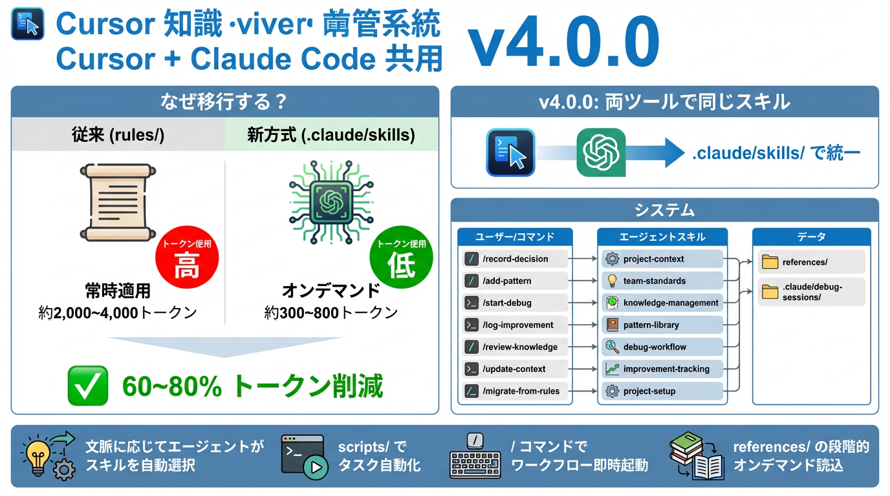
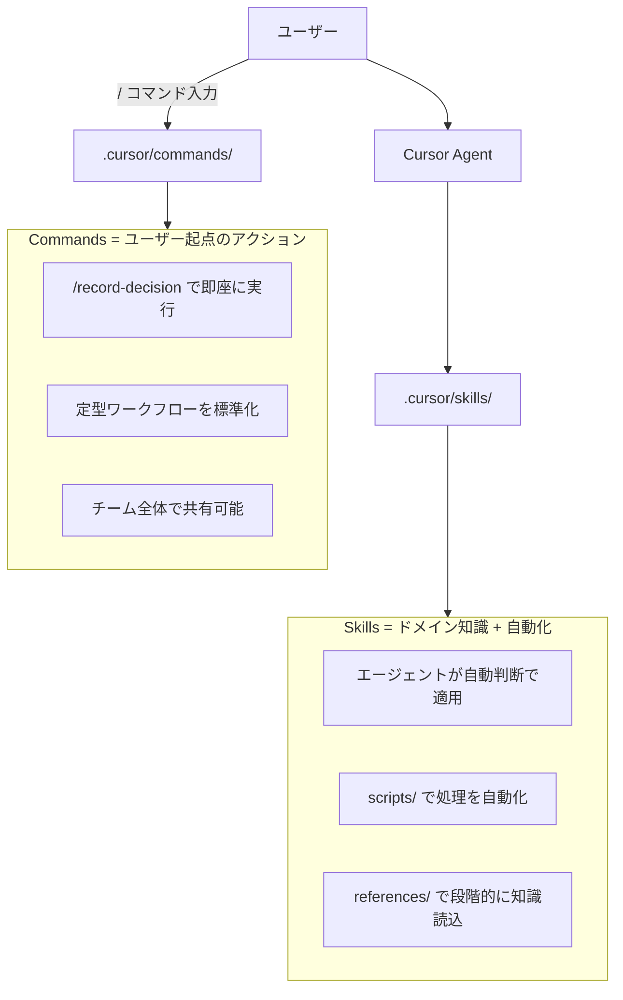

# Cursor Knowledge Management System

Cursor AI のエージェントスキル（Agent Skills）とカスタムコマンド（Commands）を活用した知識管理システムです。AI 支援開発における一貫性、品質向上、そして効率的な知識蓄積を実現します。

<p align="center">
  
</p>

## なぜ Skills + Commands なのか

従来の `.cursor/rules` では `alwaysApply: true` のルールが毎回すべてのリクエストに含まれ、globs マッチしたルールも関連性に関わらず読み込まれていました。知識ファイルも一括で渡されるため、**実際には不要なトークンが大量に消費**されていました。

Agent Skills では、エージェントが会話の文脈から必要なスキルだけを自動選択し、詳細情報は **references/ からオンデマンドで段階的に読み込み**ます。SKILL.md 本体は軽量に保たれるため、**トークン消費とコストを大幅に削減**できます。さらに scripts/ によるタスク自動化、`/` コマンドによるワークフロー即時起動により、知識を蓄積する習慣のハードルも下がります。

### トークン消費の目安

| 項目 | 旧（rules） | 新（skills） |
|------|-------------|-------------|
| **リクエストごとのベースライン** | ~2,000-4,000 tokens | ~300-800 tokens |
| 内訳: 常時読み込み | alwaysApply ルール全文（毎回） | スキルの description 一覧のみ |
| 内訳: 条件読み込み | globs マッチしたルール全文 | 文脈に合うスキルだけ選択的に |
| 内訳: 知識データ | @参照で対象ファイル全文 | references/ を必要時にオンデマンド |
| **削減率の目安** | - | **約 60-80% 削減** |

> **注**: 実際の削減率はプロジェクトの知識量、ルールの数、利用頻度により異なります。
> 知識ファイルが大きいプロジェクトほど削減効果が高くなります。

詳しい背景は [v2.x からの移行ガイド](docs/getting-started/migration-from-rules.md) を参照してください。

Cursor は [プラグイン](https://cursor.com/ja/blog/marketplace)（MCP・スキル・ルールなど）で拡張できます。本テンプレートは「スキル＋コマンド」を提供するもので、必要に応じて [Cursor Marketplace](https://cursor.com/ja/blog/marketplace) の他のプラグインと組み合わせて利用できます。

## 主な特徴

- **エージェントスキル対応**: Cursor AI 公式の Agent Skills 標準仕様を採用
- **カスタムコマンド搭載**: `/` コマンドで即座に知識管理ワークフローを起動
- **自動化スクリプト**: シェルスクリプトによる記録作成・検索の自動化
- **段階的読み込み**: references/ による効率的なコンテキスト管理
- **チーム対応**: 個人からチーム開発まで対応

## クイックスタート

### 1. リポジトリのクローン
```bash
git clone https://github.com/shioki/Cursor-Knowledge-Management-System.git
cd Cursor-Knowledge-Management-System
```

### 2. テンプレートをプロジェクトにコピー
```bash
# Mac/Linux
cp -r templates/.cursor/skills /path/to/your-project/.cursor/skills
cp -r templates/.cursor/commands /path/to/your-project/.cursor/commands
cp templates/.cursorignore /path/to/your-project/.cursorignore

# スクリプトに実行権限を付与
find /path/to/your-project/.cursor/skills -name "*.sh" -exec chmod +x {} \;
```

```powershell
# Windows (PowerShell)
Copy-Item -Path "templates\.cursor\skills" -Destination "/path/to/your-project\.cursor\skills" -Recurse
Copy-Item -Path "templates\.cursor\commands" -Destination "/path/to/your-project\.cursor\commands" -Recurse
Copy-Item -Path "templates\.cursorignore" -Destination "/path/to/your-project\.cursorignore"
```

スクリプト（init.sh / validate.sh）を使う場合は、Windows では **Git Bash** で実行するか、上記の PowerShell 手動コピー＋動作確認で代替できます。Windows で一括コピーする場合は、**PowerShell** で `templates/.cursor/skills/project-setup/scripts/init.ps1` を実行することもできます（詳しくは [クイックスタート](docs/getting-started/quick-start.md) を参照）。

### 3. 初期カスタマイズ

コピー後、以下のコマンドでプロジェクト情報を設定してください:

1. `/update-context` - プロジェクト基本情報を記入
2. `/record-decision` - 最初の技術判断を記録
3. team-standards スキルの `SKILL.md` をプロジェクトの規約に更新

## システム構成


```mermaid
graph TB
    User[ユーザー] --> Agent[Cursor Agent]

    Agent --> Skills[".cursor/skills/"]
    User -->|"/ コマンド入力"| Commands[".cursor/commands/"]

    subgraph skillsArea ["Skills = ドメイン知識 + 自動化"]
        S1["エージェントが自動判断で適用"]
        S2["scripts/ で処理を自動化"]
        S3["references/ で段階的に知識読込"]
    end

    subgraph commandsArea ["Commands = ユーザー起点のアクション"]
        C1["/record-decision で即座に実行"]
        C2["定型ワークフローを標準化"]
        C3["チーム全体で共有可能"]
    end

    Skills --> skillsArea
    Commands --> commandsArea
```

### スキルとコマンドの役割分担

| 観点 | Skills | Commands |
|------|--------|----------|
| **起動方法** | エージェントが自動判断 or `/skill-name` | ユーザーが `/command-name` で明示起動 |
| **複雑さ** | 高（scripts, references） | 低（Markdown ファイル 1 つ） |
| **用途** | ドメイン知識の提供、自動化処理 | 定型アクション、ワークフロー手順 |

## プロジェクト構造

```
cursor-knowledge-management-system/
├── templates/.cursor/              # テンプレートファイル（コピー用）
│   ├── skills/                     # エージェントスキル
│   │   ├── project-context/        # プロジェクト背景・制約
│   │   ├── team-standards/         # チーム開発標準
│   │   ├── knowledge-management/   # 技術判断記録
│   │   ├── pattern-library/        # 実装パターン管理
│   │   ├── debug-workflow/         # デバッグワークフロー
│   │   ├── improvement-tracking/   # 改善活動追跡
│   │   └── project-setup/          # セットアップ支援
│   └── commands/                   # カスタムコマンド
│       ├── record-decision.md      # /record-decision
│       ├── add-pattern.md          # /add-pattern
│       ├── start-debug.md          # /start-debug
│       ├── log-improvement.md      # /log-improvement
│       ├── review-knowledge.md     # /review-knowledge
│       ├── update-context.md       # /update-context
│       └── migrate-from-rules.md   # /migrate-from-rules
├── templates/.cursorignore         # Cursor 無視ファイル設定
├── docs/                           # ドキュメント
│   ├── getting-started/            # 導入ガイド
│   ├── templates/                  # スキル・コマンド使用ガイド
│   ├── advanced/                   # 高度な使用方法
│   └── reference/                  # 技術リファレンス
└── README.md
```

## 7 つのスキル

| スキル | 概要 |
|--------|------|
| **project-context** | プロジェクトの背景・制約・技術スタックに基づいた提案 |
| **team-standards** | コーディング規約、命名規則、開発フローの標準 |
| **knowledge-management** | 技術判断の記録・参照・検索 |
| **pattern-library** | 実装パターンの検索・適用・登録 |
| **debug-workflow** | デバッグプロセスの支援と過去事例の検索 |
| **improvement-tracking** | 改善提案の記録・効果測定・追跡 |
| **project-setup** | 新規プロジェクトへの導入・構造検証 |

## 7 つのコマンド

| コマンド | 概要 |
|----------|------|
| `/record-decision` | 技術判断を即座に記録 |
| `/add-pattern` | 実装パターンを登録 |
| `/start-debug` | デバッグセッションを開始 |
| `/log-improvement` | 改善内容を記録 |
| `/review-knowledge` | 知識ベースを定期レビュー |
| `/update-context` | プロジェクトコンテキストを更新 |
| `/migrate-from-rules` | v2.x（.cursor/rules）からの対話型移行 |

## ドキュメント

### Getting Started
- **[クイックスタート](docs/getting-started/quick-start.md)** - 5 分で始める導入手順
- **[スキルとコマンドの概要](docs/getting-started/skills-and-commands.md)** - 基本概念と使い方
- **[v2.x からの移行ガイド](docs/getting-started/migration-from-rules.md)** - .cursor/rules からの移行方法

### ガイド
- **[スキルガイド](docs/templates/skills-guide.md)** - 7 つのスキルの詳細な使い方
- **[コマンドガイド](docs/templates/commands-guide.md)** - 7 つのコマンドの詳細な使い方

### Advanced
- **[チーム導入ガイド](docs/advanced/team-implementation.md)** - チーム全体での活用方法
- **[カスタムスキル・コマンド作成](docs/advanced/custom-skills.md)** - 独自のスキルとコマンドの作り方

### Reference
- **[完全ガイド](docs/cursor-knowledge-management-system.md)** - システムの詳細説明
- **[Cursor プラグイン・マーケットプレイス](docs/reference/cursor-plugins-and-marketplace.md)** - プラグイン構成と本システムの対応
- **[開発ログ](docs/reference/development-log.md)** - システム開発の記録

## システム要件

- **Cursor AI**: 2.4 以上（Agent Skills 対応）
- **Git**: 2.0 以上
- **Mac/Linux**: Bash は標準で利用可能。スクリプト（init.sh / validate.sh）はそのまま実行可能。
- **Windows**: コピーは PowerShell で可能。スクリプト実行には **Git Bash** または **WSL** を推奨。

## 品質チェック

```bash
# ワンコマンドで全検証を実行
npm run docs:check
```

品質チェック（`npm run docs:check` など）は **Windows でもそのまま利用可能**です（Node.js が入っていれば実行できます）。

- **スキル構造検証**: `npm run skills:check` - SKILL.md の存在・フロントマター・フォルダ名一致を検証
- **コマンド構造検証**: `npm run commands:check` - コマンドファイルの存在・内容を検証
- **リンクチェック**: `npm run links:check` - Markdown 内リンクの死活チェック

### リリース（GitHub Release）

`gh` の認証が必要です。未設定の場合は [GitHub リリース手順](docs/reference/github-release.md) を参照してください。

```bash
npm run release -- v3.1.0
```

**Windows でリリースする場合**: `scripts/release.sh` は Bash 前提のため、**Git Bash** または **WSL** で `npm run release -- v3.1.0` を実行してください。

## ライセンス

MIT License - 詳細は [LICENSE](LICENSE) ファイルを参照

## 貢献

このプロジェクトへの貢献を歓迎します。詳細は [開発ログ](docs/reference/development-log.md) を参照してください。

---

**最終更新**: 2026-02-25
**バージョン**: 3.1.0
**変更履歴**: [CHANGELOG.md](CHANGELOG.md) を参照
