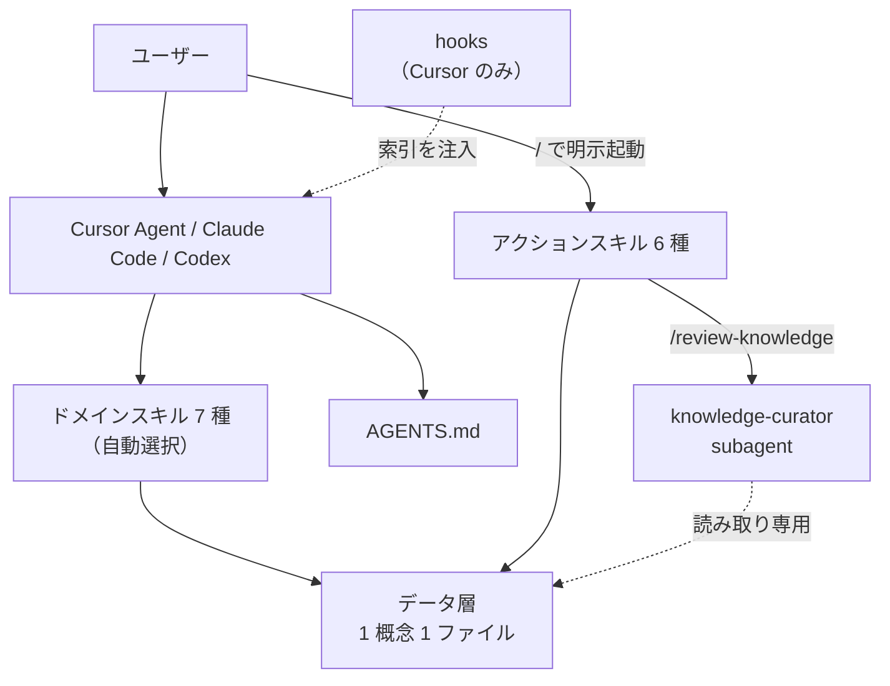

# Cursor Knowledge Management System

技術判断・実装パターン・デバッグ記録・改善活動をプロジェクト内に蓄積し、次の作業で自動的に活かすための知識管理システムです。Agent Skills 13 種を中心に、記録を促す hooks と棚卸し用の subagent を組み合わせています。Cursor・Claude Code・Codex いずれでも `.agents/skills/` 上の同一スキルを共用できます。

英語の短い導入は [README.en.md](README.en.md) を参照してください。

> **v6.0.0**: **すべての機能を Agent Skills に統一**し、配布物をリポジトリ直下へ集約しました。コマンドはアクションスキルへ統合され、Cursor 以外のエージェントからも使えます。加えて **hooks** と **subagent** を新規提供し、知識層を **1 概念 1 ファイル**に分割しました。
> - 新規: [hooks ガイド](docs/advanced/hooks-guide.md) — 記録を習慣にする仕組み
> - 新規: [subagents ガイド](docs/advanced/subagents-guide.md) — 知識ベースの棚卸し
> - 新規: [アクションスキルガイド](docs/templates/action-skills-guide.md)
> - 破壊的変更と移行手順: [v5 からの移行ガイド](docs/getting-started/migration-from-v5.md)

## なぜ Agent Skills なのか

従来の `.cursor/rules` では `alwaysApply: true` のルールが毎回すべてのリクエストに含まれ、glob にマッチしたルールも関連性に関わらず読み込まれていました。知識ファイルも一括で渡されるため、実際には不要なトークンが消費されます。

Agent Skills では、エージェントがまず各スキルの `description` だけを読み、会話の文脈に合うものを選びます。選ばれたスキルの本文を読み、さらに必要なら `references/` を開く、という段階的な読み込みです。

### 何が読み込まれるか

| 段階 | 旧（rules） | 新（skills） |
|------|-------------|-------------|
| 常時 | `alwaysApply` ルールの全文 | 各スキルの `description` 一覧のみ |
| 条件付き | glob にマッチしたルールの全文 | 文脈に合うスキルの本文だけ |
| 知識データ | `@` 参照で対象ファイルの全文 | `references/` の該当ファイルだけ |

削減量はプロジェクトのルール数・知識量・利用頻度に完全に依存するため、一般的な数値は示しません。手元で比較したい場合は、移行前後の同じ質問でリクエストのトークン数を確認してください。効果が大きいのは、知識ファイルが肥大化しているプロジェクトです。

v6 では知識層を 1 概念 1 ファイルに分割し、ディレクトリごとの `README.md` を索引にしました。v5 までは単一ファイルへの追記方式だったため、記録が増えるほど参照のたびに全体を読むことになり、段階的読み込みという前提が崩れていました。

詳しい背景は [v2.x からの移行ガイド](docs/getting-started/migration-from-rules.md) を参照してください。

## 主な特徴

- **すべてが Agent Skills**（v6.0.0）: ドメインスキル 7 種 + アクションスキル 6 種。Cursor 独自機能に依存しない
- **hooks による記録支援**（v6.0.0）: 会話開始時に知識の索引を注入し、編集活動を記録する
- **knowledge-curator subagent**（v6.0.0）: 知識ベースの全走査を別コンテキストに隔離する
- **1 概念 1 ファイル**（v6.0.0）: 記録が増えても読み込みコストが上がらない構造
- **4 つの配布経路**: init スクリプト / Cursor Marketplace / `gh skill` / Microsoft APM
- **マルチエージェント対応**: `.agents/skills/` を軸に Cursor / Claude Code / Codex で共用
- **AGENTS.md テンプレート**: ルート用・ネストサブディレクトリ用を同梱

## クイックスタート

### 1. init スクリプト（推奨）

```bash
git clone https://github.com/shioki/Cursor-Knowledge-Management-System.git
cd Cursor-Knowledge-Management-System

# 既定: .agents/skills に配置（Cursor / Claude Code / Codex 共用）
bash skills/project-setup/scripts/init.sh /path/to/your-project

# 確認プロンプトを出さずに実行（CI・自動化向け）
bash skills/project-setup/scripts/init.sh /path/to/your-project --yes

# AGENTS.md テンプレートも配置
bash skills/project-setup/scripts/init.sh /path/to/your-project --with-agents-md

# hooks / subagent を配置しない
bash skills/project-setup/scripts/init.sh /path/to/your-project --no-hooks --no-agents

# v4.x 互換（.claude/skills に配置）
bash skills/project-setup/scripts/init.sh /path/to/your-project --legacy-claude

# Cursor のみ（.cursor/skills に配置）
bash skills/project-setup/scripts/init.sh /path/to/your-project --cursor-only
```

Windows では同じディレクトリの `init.ps1` を利用できます。

```powershell
.\skills\project-setup\scripts\init.ps1 -TargetPath "C:\path\to\your-project" -WithAgentsMd
```

### 2. Cursor Marketplace（Plugin）

Marketplace からプラグインとしてインストールできます。提出手順は [Marketplace 提出手順](docs/reference/marketplace-submission.md)、ローカルテストは [Cursor Plugin 開発ガイド](docs/advanced/plugin-development.md) を参照してください。

### 3. gh skill（個別スキル単位）

```bash
# 最新版
gh skill install shioki/Cursor-Knowledge-Management-System knowledge-management --agent cursor

# タグ固定版（サプライチェーン保全）
gh skill install shioki/Cursor-Knowledge-Management-System knowledge-management --agent cursor --pin v6.0.0
```

v6 でスキルを非隠しディレクトリ `skills/` に移したため、`--allow-hidden-dirs` は不要になりました。詳細は [gh skill 連携](docs/reference/gh-skill-integration.md) を参照してください。

### 4. Microsoft APM（バンドル単位）

```yaml
dependencies:
  apm:
    - shioki/Cursor-Knowledge-Management-System#v6.0.0
```

```bash
apm install
```

詳細は [APM 連携](docs/reference/apm-integration.md) を参照してください。

### 手動コピー

```bash
# Mac/Linux
CKMS=/path/to/Cursor-Knowledge-Management-System
TARGET=/path/to/your-project

cp -r "$CKMS/skills" "$TARGET/.agents/skills"
cp -r "$CKMS/agents" "$TARGET/.cursor/agents"
cp -r "$CKMS/hooks"  "$TARGET/.cursor/hooks"
cp "$CKMS/templates/.cursorignore" "$TARGET/.cursorignore"
mkdir -p "$TARGET/.agents/debug-sessions"
find "$TARGET/.agents/skills" -name "*.sh" -exec chmod +x {} \;
```

`.cursor/hooks.json` は [hooks/hooks.json](hooks/hooks.json) を参考に作成し、スクリプトのパスを `.cursor/hooks/` 起点に書き換えてください。

詳しくは [クイックスタート](docs/getting-started/quick-start.md) を参照してください。

### 初期カスタマイズ

導入後、以下を実施してください。ここを飛ばすとスキルは空のテンプレートを参照するだけになります。

1. `/update-context` — プロジェクト基本情報を記入
2. `/record-decision` — 最初の技術判断を記録
3. `team-standards` スキルの `SKILL.md` をプロジェクトの規約に更新

## システム構成


```mermaid
graph TB
    User[ユーザー] --> Agent[Cursor Agent / Claude Code / Codex]

    Agent --> Domain["ドメインスキル 7 種<br/>（自動選択）"]
    User -->|"/ で明示起動"| Action["アクションスキル 6 種"]
    Agent --> AgentsMd["AGENTS.md"]

    Hooks["hooks<br/>（Cursor のみ）"] -.索引を注入.-> Agent
    Action -->|"/review-knowledge"| Sub["knowledge-curator<br/>subagent"]

    Domain --> Data["データ層<br/>1 概念 1 ファイル"]
    Action --> Data
    Sub -.読み取り専用.-> Data
```

### 各コンポーネントの役割

| | ドメインスキル | アクションスキル | hooks | subagent | AGENTS.md |
|---|---|---|---|---|---|
| **起動** | エージェントが自動判断 | ユーザーが `/名前` | イベント駆動 | スキルから委譲 | 常時参照 |
| **役割** | 回答に知識を反映 | 記録・レビューの実行 | 記録の起点を作る | 大量走査の隔離 | 全体の基本方針 |
| **配置** | `.agents/skills/` | `.agents/skills/` | `.cursor/hooks/` | `.cursor/agents/` | ルート or サブディレクトリ |
| **共有** | 全エージェント | 全エージェント | Cursor のみ | Cursor のみ | 全エージェント |

hooks と subagent は Cursor 固有の機能なので共有されませんが、どちらも補助機能であり、無くてもスキルは動作します。

## プロジェクト構造

```text
cursor-knowledge-management-system/
├── skills/                         # スキル 13 種（唯一の正）
│   ├── project-context/            # 以下 7 種はドメインスキル
│   ├── team-standards/
│   ├── knowledge-management/
│   ├── pattern-library/
│   ├── debug-workflow/
│   ├── improvement-tracking/
│   ├── project-setup/
│   ├── record-decision/            # 以下 6 種はアクションスキル
│   ├── add-pattern/
│   ├── start-debug/
│   ├── log-improvement/
│   ├── review-knowledge/
│   └── update-context/
├── agents/
│   └── knowledge-curator.md        # 知識ベース棚卸し（readonly）
├── hooks/
│   ├── hooks.json
│   ├── inject-knowledge-index.sh   # sessionStart
│   ├── log-activity.sh             # afterFileEdit
│   └── suggest-record.sh           # stop（既定で無効）
├── .cursor-plugin/plugin.json      # Cursor Plugin マニフェスト
├── apm.yml                         # Microsoft APM マニフェスト
├── schemas/                        # 公式スキーマのベンダリング
├── templates/
│   ├── .cursorignore
│   ├── AGENTS.md.template
│   └── AGENTS.md.nested-example.md
├── docs/
├── scripts/                        # 検証・リリーススクリプト
├── AGENTS.md                       # このリポジトリ自身の開発指針
└── README.md
```

配布物を隠しディレクトリではなくルート直下に置いているのは、Cursor Plugin のデフォルト探索・`gh skill install`・`apm install` の 3 経路すべてがこの配置で動くためです。

## ドメインスキル 7 種

エージェントが会話の文脈から自動的に選択します。

| スキル | 概要 |
|--------|------|
| **project-context** | プロジェクトの背景・制約・技術スタックに基づいた提案 |
| **team-standards** | コーディング規約、命名規則、開発フローの標準 |
| **knowledge-management** | 技術判断の記録・参照・検索 |
| **pattern-library** | 実装パターンの検索・適用・登録 |
| **debug-workflow** | デバッグプロセスの支援と過去事例の検索 |
| **improvement-tracking** | 改善提案の記録・効果測定・追跡 |
| **project-setup** | 新規プロジェクトへの導入・構造検証 |

`team-standards` には frontmatter の `paths` を設定し、ソースコードを扱っているときだけ読み込まれるようにしています。

## アクションスキル 6 種

`disable-model-invocation: true` を持ち、ユーザーが `/` で明示的に起動したときだけ動きます。

| 起動 | 概要 |
|------|------|
| `/record-decision` | 技術判断を記録 |
| `/add-pattern` | 実装パターンを登録 |
| `/start-debug` | デバッグセッションを開始 |
| `/log-improvement` | 改善内容を記録 |
| `/review-knowledge` | 知識ベースを棚卸し（`knowledge-curator` に委譲） |
| `/update-context` | プロジェクトコンテキストを更新 |

v5 まで `.cursor/commands/` にあった `/migrate-from-rules` は廃止しました。Cursor 組み込みの `/migrate-to-skills` と役割が重複するためです。

## hooks 3 種

| イベント | 役割 | 既定 |
|---------|------|------|
| `sessionStart` | 蓄積済み知識の索引を初期コンテキストへ注入 | 有効 |
| `afterFileEdit` | 編集したファイルを軽量ログに追記 | 有効 |
| `stop` | 記録漏れがありそうなときに記録を促す | 無効 |

`stop` フックは 1 ターンを消費するため既定で無効です。詳細と設定方法は [hooks ガイド](docs/advanced/hooks-guide.md) を参照してください。

## ドキュメント

### Getting Started

- **[クイックスタート](docs/getting-started/quick-start.md)** — 導入方法の選び方とセットアップ手順
- **[スキルの全体像](docs/getting-started/skills-and-commands.md)** — ドメインスキルとアクションスキルの違い
- **[AGENTS.md 運用ガイド](docs/getting-started/agents-md-guide.md)** — ルート / ネスト AGENTS.md の使い分け
- **[Cursor + Claude Code 並行利用ガイド](docs/getting-started/parallel-use-cursor-claude.md)** — 複数エージェントでの共有
- **[v5 からの移行ガイド](docs/getting-started/migration-from-v5.md)** — v6 への移行手順
- **[v3 からの移行ガイド](docs/getting-started/migration-from-v3.md)**
- **[v2.x からの移行ガイド](docs/getting-started/migration-from-rules.md)** — `.cursor/rules` からの移行

### ガイド

- **[スキルガイド](docs/templates/skills-guide.md)** — ドメインスキル 7 種の詳細
- **[アクションスキルガイド](docs/templates/action-skills-guide.md)** — アクションスキル 6 種の詳細

### Advanced

- **[hooks ガイド](docs/advanced/hooks-guide.md)** — 記録を習慣にする仕組み
- **[subagents ガイド](docs/advanced/subagents-guide.md)** — knowledge-curator と独自 subagent
- **[カスタムスキル作成](docs/advanced/custom-skills.md)** — 独自スキルの作り方
- **[チーム導入ガイド](docs/advanced/team-implementation.md)** — チーム全体での活用方法
- **[Cursor Plugin 開発ガイド](docs/advanced/plugin-development.md)** — ローカルテストと Marketplace 準備

### Reference

- **[完全ガイド](docs/cursor-knowledge-management-system.md)** — システム全体の設計と方法論
- **[OKF 調査と知識形式の改善方針](docs/reference/okf-and-knowledge-evolution.md)** — Google OKF の調査と対応方針
- **[Cursor プラグイン・マーケットプレイス](docs/reference/cursor-plugins-and-marketplace.md)** — プラグイン構成と本システムの対応
- **[Marketplace 提出手順](docs/reference/marketplace-submission.md)** — 審査フローとチェックリスト
- **[gh skill 連携](docs/reference/gh-skill-integration.md)** — GitHub CLI でのスキル配布
- **[APM 連携](docs/reference/apm-integration.md)** — Microsoft APM による依存管理
- **[GitHub リリース手順](docs/reference/github-release.md)** — リリース作成の手順
- **[開発ログ](docs/reference/development-log.md)** — システム開発の記録

## システム要件

- **Cursor**: 3.0 以上推奨（`.agents/skills/` の公式サポート、hooks、subagents）。2.4 以上でも `.cursor/skills/` 経由でスキルのみ動作
- **Git**: 2.0 以上
- **Mac / Linux**: Bash は標準で利用可能。スクリプトはそのまま実行できます
- **Windows**: スクリプトの実行には **Git Bash** または **WSL** が必要です。セットアップのみ `init.ps1` で完結します
- **（任意）GitHub CLI**: `gh skill install` 利用時に `v2.90.0` 以上
- **（任意）APM**: [公式インストーラ](https://github.com/microsoft/apm) を参照

hooks スクリプトは `jq` / `python` / `node` に依存しません。POSIX シェルと `sed` / `awk` / `find` のみを使います。

## 品質チェック

```bash
npm run docs:check
```

| コマンド | 内容 |
|---------|------|
| `npm run skills:check` | SKILL.md の Agent Skills 仕様準拠、`templates/` への複製ガード |
| `npm run components:check` | `hooks.json` のイベント名・スクリプト存在・実行権限、subagent の frontmatter |
| `npm run plugin:check` | `plugin.json` を公式スキーマで検証（ajv）、`apm.yml` とのバージョン整合 |
| `npm run links:check` | `README` / `docs` / `skills` / `agents` / `hooks` / `templates` のリンク切れ |
| `npm run skill:check` | `gh skill publish --dry-run`（GitHub CLI 必須） |

Node.js があれば Windows でもそのまま実行できます。

導入先プロジェクトの構造検証には、同梱の `validate.sh` を使います。

```bash
bash .agents/skills/project-setup/scripts/validate.sh
```

### リリース（GitHub Release）

`gh` の認証が必要です。未設定の場合は [GitHub リリース手順](docs/reference/github-release.md) を参照してください。

```bash
npm run release -- v6.0.0
```

**Windows でリリースする場合**: `scripts/release.sh` は Bash 前提のため、Git Bash または WSL で実行してください。

**immutable release の有効化（推奨）**: GitHub リポジトリの Settings → Rules → Releases → Require immutable を有効化してください。`gh skill install --pin` や `apm install <repo>#<tag>` の供給網保全に寄与します。

## ライセンス

MIT License — 詳細は [LICENSE](LICENSE) ファイルを参照

## 貢献

このプロジェクトへの貢献を歓迎します。PR 前の検証手順と版数の揃え方は [CONTRIBUTING.md](CONTRIBUTING.md) を参照してください。リポジトリ自体の開発指針は [AGENTS.md](AGENTS.md) にまとめています。

---

**最終更新**: 2026-08-01
**バージョン**: 6.0.0（[リリースノート](RELEASE_NOTES_v6.0.0.md)）
**変更履歴**: [CHANGELOG.md](CHANGELOG.md) を参照
