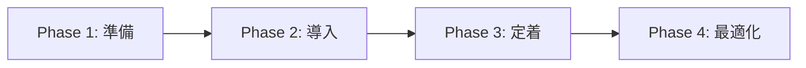

# チーム導入ガイド

## 概要

Cursor Knowledge Management System をチーム全体に導入し、知識共有と開発品質の向上を実現するためのガイドです。

## 導入フロー



## Phase 1: 準備（1 週間）

### 1. チームリーダーによるシステム理解
- [クイックスタート](../getting-started/quick-start.md) で基本操作を習得
- [スキルとコマンドの概要](../getting-started/skills-and-commands.md) で仕組みを理解
- [スキルガイド](../templates/skills-guide.md) で各スキルの役割を把握

### 2. プロジェクト固有のカスタマイズ

#### team-standards のカスタマイズ
`.cursor/skills/team-standards/SKILL.md` をチームの規約に合わせて編集:
- 命名規則をプロジェクトに合わせる
- ブランチ戦略を実際のフローに合わせる
- コミットメッセージ規約を統一する

#### コンテキスト情報の記入
`/update-context` コマンドでプロジェクト情報を記入:
- 技術スタック
- アーキテクチャ概要
- チーム体制

### 3. 初期知識の記録
- `/record-decision` で過去の重要な技術判断を記録
- `/add-pattern` で既存の実装パターンを登録

## Phase 2: 導入（2 週間）

### 1. チームメンバーへの展開

```bash
# 各メンバーのプロジェクトに反映
git pull  # skills/ と commands/ を含むコミットを取得
```

### 2. チーム向けオリエンテーション

以下を共有:
- **スキル**: エージェントが自動的に適用するドメイン知識
- **コマンド**: `/` で起動する定型ワークフロー
- **日常の使い方**: 技術判断時に `/record-decision`、バグ発生時に `/start-debug`

### 3. チームコマンドの活用

Cursor Team プランを使用している場合、[Cursor Dashboard](https://cursor.com/dashboard?tab=team-content&section=commands) でチームコマンドを作成できます:
- チーム共通のワークフローを一元管理
- 管理者がコマンドを更新すると全メンバーに自動反映
- ファイル配布が不要

## Phase 3: 定着（1-2 ヶ月）

### 1. 日常的な知識記録の習慣化

| タイミング | アクション | コマンド |
|-----------|-----------|---------|
| 技術判断時 | 判断理由を記録 | `/record-decision` |
| 実装完了時 | パターンを登録 | `/add-pattern` |
| バグ修正後 | セッションを記録 | `/start-debug` |
| リファクタ後 | 改善を記録 | `/log-improvement` |
| 週次ミーティング | 知識レビュー | `/review-knowledge` |

### 2. 定期レビューの実施

**週次（15 分）:**
- 新しい記録の共有
- 未記録の重要判断の確認

**月次（30 分）:**
- `/review-knowledge` で知識ベースの棚卸し
- パターンの効果測定
- 改善提案のステータス確認

**四半期（1 時間）:**
- アーキテクチャ決定の振り返り
- `/update-context` でコンテキスト情報の大幅更新
- 知識管理プロセスの改善

### 3. 品質指標のモニタリング

| 指標 | 測定方法 | 目標 |
|------|---------|------|
| 技術判断の記録率 | KNOWLEDGE_TEMPLATE の更新頻度 | 主要判断の 80% 以上 |
| パターン再利用率 | 新規実装時の既存パターン活用 | 向上 |
| バグ再発率 | 同種バグの発生回数 | 削減 |
| 問題解決時間 | デバッグセッションの所要時間 | 短縮 |

## Phase 4: 最適化（継続）

### 1. カスタムスキル・コマンドの追加

プロジェクト固有のニーズに応じて、独自のスキルやコマンドを作成:
- [カスタムスキル・コマンド作成](custom-skills.md) を参照
- チーム共通のワークフローをコマンド化
- ドメイン固有の知識をスキル化

### 2. プロセスの改善

- 効果の薄いスキルの見直し
- コマンドのワークフロー最適化
- 新しいコマンドの提案と実装

### 3. ナレッジの拡張

- 新しいチームメンバーのオンボーディング資料としての活用
- プロジェクト間の知識移転
- ベストプラクティスのライブラリ化

## Git でのスキル・コマンド管理

### .gitignore の設定

スキルとコマンドはバージョン管理に含めることを推奨しますが、個人用ファイルは除外します:

```gitignore
# デバッグセッション（個人用）
.cursor/debug-sessions/personal-*

# 個人メモ
.cursor/personal-notes.md
```

### ブランチ戦略

- スキル・コマンドの変更は `main` ブランチに直接コミット
- 大きなカスタマイズは feature ブランチで実施

## トラブルシューティング

**Q: チームメンバー間でスキルの内容が異なる**
A: `git pull` で最新版を取得してください。スキルファイルはリポジトリで管理されます。

**Q: コマンドがチーム全員に表示されない**
A: `.cursor/commands/` ディレクトリがリポジトリに含まれているか確認してください。Team プランの場合はチームコマンドの利用も検討してください。

**Q: スキルの自動適用が期待通りに動かない**
A: `SKILL.md` の `description` を見直してください。エージェントはこの説明文に基づいて自動判断します。

---

**参考リンク:**
- [クイックスタート](../getting-started/quick-start.md)
- [スキルガイド](../templates/skills-guide.md)
- [コマンドガイド](../templates/commands-guide.md)
- [カスタムスキル・コマンド作成](custom-skills.md)
