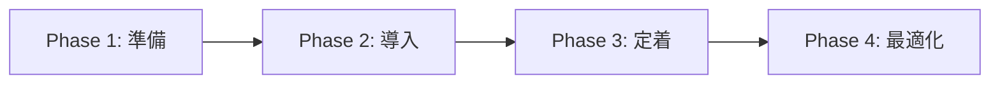

# チーム導入ガイド

## 概要

Cursor Knowledge Management System をチーム全体に導入し、知識共有と開発品質の向上を実現するためのガイドです。

v6 では配布物がスキル 13 種・subagent・hooks の 3 つにまとまり、すべてリポジトリのファイルとして共有されます。Cursor 専用の設定は subagent と hooks だけで、スキルは Cursor / Claude Code / Codex のどれからでも同じものが読まれます。チーム内でエディタが統一されていなくても、知識ベースは共有できます。

## 導入フロー


```mermaid
graph LR
    A["Phase 1: 準備"] --> B["Phase 2: 導入"]
    B --> C["Phase 3: 定着"]
    C --> D["Phase 4: 最適化"]
```

## Phase 1: 準備（1 週間）

### 1. チームリーダーによるシステム理解

- [クイックスタート](../getting-started/quick-start.md) で基本操作を習得
- [スキルガイド](../templates/skills-guide.md) でドメインスキル 7 種の役割を把握
- [アクションスキルガイド](../templates/action-skills-guide.md) で `/` から起動する 6 種を把握

v5 から更新する場合は [v5 からの移行ガイド](../getting-started/migration-from-v5.md) を先に確認してください。`.cursor/commands/` を残したままだと `/` の候補が重複します。

### 2. プロジェクト固有のカスタマイズ

#### team-standards のカスタマイズ

`.agents/skills/team-standards/SKILL.md` をチームの規約に合わせて編集します。

- 命名規則をプロジェクトに合わせる
- ブランチ戦略を実際のフローに合わせる
- コミットメッセージ規約を統一する
- frontmatter の `paths` をチームが実際に使う言語に絞る

`paths` はこのスキルが surface する条件です。既定では主要な言語のソースファイルを列挙してありますが、単一言語のプロジェクトなら該当する行だけ残したほうが、無関係な会話でのトークン消費を抑えられます。

#### コンテキスト情報の記入

`/update-context` でプロジェクト情報を記入します。

- 技術スタック
- アーキテクチャ概要
- チーム体制

ここが空のままだと、他のすべてのスキルの提案精度が落ちます。導入時に必ず埋めてください。

### 3. 初期知識の記録

- `/record-decision` で過去の重要な技術判断を記録
- `/add-pattern` で既存の実装パターンを登録

過去の判断をすべて掘り起こす必要はありません。新しくチームに入った人が最初に聞く 3〜5 件から始めるのが現実的です。

## Phase 2: 導入（2 週間）

### 1. チームメンバーへの展開

配布元のリポジトリからセットアップし、生成されたファイルをコミットしてチームに配ります。

```bash
# 配布元で
bash skills/project-setup/scripts/init.sh /path/to/your-project --with-agents-md
```

各メンバー側は `git pull` するだけです。

```bash
git pull   # .agents/skills/ と .cursor/agents/ .cursor/hooks/ を含むコミットを取得
```

Windows のメンバーがいる場合は、`init.ps1` を使うか Git Bash / WSL で `init.sh` を実行してもらってください。hooks スクリプトは Bash 前提です。

### 2. チーム向けオリエンテーション

共有すべきことは 3 点です。

- **ドメインスキル**: エージェントが文脈に応じて自動的に読み込む。ユーザーが意識する必要はない
- **アクションスキル**: `/record-decision` のように `/` で明示的に起動する。記録を残す操作はすべてこちら
- **日常の使い方**: 技術判断をしたら `/record-decision`、バグを踏んだら `/start-debug`

v5 まで slash command だったものが v6 ではスキルになりましたが、入力の仕方は変わりません。既存メンバーへの説明は「Claude Code や Codex でも同じ `/` が使えるようになった」で足ります。

### 3. hooks の共有方針を決める

hooks は `.cursor/hooks.json` と `.cursor/hooks/` としてリポジトリに入るため、コミットすればチーム全員で共有されます。導入前に次を確認してください。

| フック | 既定 | チームで共有する際の注意 |
|-------|------|------------------------|
| `sessionStart` | 有効 | 会話の冒頭に知識の索引を注入する。索引だけなので負荷は小さい |
| `afterFileEdit` | 有効 | 編集ファイルを `<base>/knowledge-activity.log` に追記する。ログは個人の作業履歴なので Git 管理から外す |
| `stop` | **無効** | 記録漏れを検知して次のターンを自動送信する。1 ターン分のコストがかかるため既定で無効 |

`stop` フックを有効にするかどうかは、チームで合意してから決めてください。有効化は `<base>/knowledge-hooks.conf` に `suggest_record = true` を書くだけですが、この設定ファイルをコミットすると全員に適用されます。試す場合は、まず数人で個人設定として運用し、邪魔にならないことを確認してから共有するのが安全です。

```ini
# <base>/knowledge-hooks.conf
suggest_record = true
suggest_min_files = 5
```

hooks が不要なメンバーがいる場合は、`init.sh --no-hooks` で配置を省略できます。hooks が無くてもスキルは通常どおり動作します。詳細は [hooks ガイド](hooks-guide.md) を参照してください。

### 4. Cursor Team プランのチームコマンド

Cursor Team プランを使っている場合、[Cursor Dashboard](https://cursor.com/dashboard?tab=team-content&section=commands) でチーム共通のコマンドを配布できます。本システムのアクションスキルとは別の仕組みで、Cursor 専用です。組織横断で使いたい手順（申請フローなど）はこちらに、プロジェクト固有の知識管理はアクションスキルにと使い分けてください。

## Phase 3: 定着（1-2 ヶ月）

### 1. 日常的な知識記録の習慣化

| タイミング | アクション | 起動 |
|-----------|-----------|------|
| 技術判断時 | 判断理由を記録 | `/record-decision` |
| 実装完了時 | パターンを登録 | `/add-pattern` |
| バグ調査開始時 | セッションを開始 | `/start-debug` |
| リファクタ後 | 改善を記録 | `/log-improvement` |
| 月次ミーティング | 知識レビュー | `/review-knowledge` |
| 前提が変わったとき | コンテキスト更新 | `/update-context` |

### 2. 記録がコンフリクトしにくい構造

v6 では技術判断・パターン・改善が 1 概念 1 ファイルになりました。ファイル名に日付とスラッグが入るため、複数人が同じ日に別々の判断を記録してもファイルが衝突しません。

```
.agents/skills/knowledge-management/references/decisions/
├── README.md                          # 索引
├── 2026-07-20-adopt-vitest.md         # A さんの記録
└── 2026-07-20-drop-legacy-api.md      # B さんの記録
```

コンフリクトが起きうるのは索引の `README.md` だけで、表に 1 行追加されるだけなので解決も容易です。v5 までのように単一の `KNOWLEDGE_TEMPLATE.md` へ追記し続ける方式では、同じファイルの同じ位置に複数人が追記して毎回コンフリクトしていました。記録の習慣が定着しない原因のひとつがこれでした。

チーム作業では、記録を含む変更も通常のブランチに載せて PR でレビューできます。判断そのものをレビュー対象にできる点は、単一ファイル方式より扱いやすいはずです。

### 3. 定期レビューの実施

**週次（15 分）:**

- 新しい記録の共有
- 未記録の重要判断の確認

**月次（30 分）:**

- `/review-knowledge` で知識ベースの棚卸し
- パターンの効果測定
- 改善提案のステータス確認

**四半期（1 時間）:**

- アーキテクチャ決定の振り返り
- `/update-context` でコンテキスト情報の大幅更新
- 知識管理プロセスの改善

`/review-knowledge` は `knowledge-curator` subagent に走査を委譲します。知識ベース全体を読む処理をメインの会話から切り離すため、レビュー結果だけが手元に返ります。件数が増えても会話が重くなりません（[subagents ガイド](subagents-guide.md)）。

### 4. 品質指標のモニタリング

| 指標 | 測定方法 | 目標 |
|------|---------|------|
| 技術判断の記録率 | `references/decisions/` のファイル数の推移 | 主要判断の 80% 以上 |
| パターン再利用率 | 新規実装時の既存パターン活用 | 向上 |
| バグ再発率 | 同種バグの発生回数 | 削減 |
| 問題解決時間 | デバッグセッションの所要時間 | 短縮 |
| 記録漏れ | `/review-knowledge` が挙げる候補の数 | 減少 |

`afterFileEdit` フックを有効にしていれば、活動ログから「よく触っているのに記録が無いモジュール」を機械的に洗い出せます。記録率を主観で測るより実態に近い数字になります。

## Phase 4: 最適化（継続）

### 1. カスタムスキルの追加

プロジェクト固有のニーズに応じて独自のスキルを作成します。ドメインスキルとアクションスキルの使い分け、frontmatter の書き方は [カスタムスキル作成ガイド](custom-skills.md) を参照してください。

チーム共通の定型手順はアクションスキル、レビュー観点やドメイン知識はドメインスキルが向いています。

### 2. プロセスの改善

- 効果の薄いスキルの見直し（読み込まれていないスキルは `description` を疑う）
- `paths` の調整による surface 範囲の最適化
- hooks の設定値（索引の件数上限、記録提案の閾値）の調整

### 3. ナレッジの拡張

- 新しいチームメンバーのオンボーディング資料としての活用
- プロジェクト間の知識移転
- ベストプラクティスのライブラリ化

## Git での管理

### コミットするもの / しないもの

| 対象 | 扱い |
|------|------|
| `.agents/skills/` | コミットする。スキル本体と蓄積した知識 |
| `.cursor/agents/` | コミットする。subagent 定義 |
| `.cursor/hooks/` `.cursor/hooks.json` | コミットする。チームで共有する場合 |
| `<base>/knowledge-hooks.conf` | チームで統一するならコミット、個人設定なら除外 |
| `<base>/knowledge-activity.log` | 除外する。個人の作業履歴で、共有する意味がない |
| `<base>/debug-sessions/` | 原則コミットする。個人用の試行は `personal-*` で除外 |

### .gitignore の設定

```gitignore
# hooks が生成する活動ログ（個人の作業履歴）
.agents/knowledge-activity.log

# デバッグセッション（個人用）
.agents/debug-sessions/personal-*

# 個人メモ
.agents/personal-notes.md
```

同じ内容が `templates/.cursorignore` にも入っているため、インデックス対象からも外れます。

### ブランチ戦略

- スキルの内容変更やチーム規約の更新は、通常の開発と同じく PR でレビューする
- 日々の記録（判断・パターン・改善）は、関連する実装の PR に含めるのが自然。実装と理由が同じ PR に載る
- 大きなカスタマイズは feature ブランチで実施する

## トラブルシューティング

**Q: チームメンバー間でスキルの内容が異なる**

A: `git pull` で最新版を取得してください。スキルファイルはリポジトリで管理されます。配布元を更新した場合は、`init.sh` を再実行して上書きするか、差分を手動で反映してください。

**Q: `/` の候補にアクションスキルが出てこない**

A: `.agents/skills/` 配下に該当するスキルのフォルダがあるか、`SKILL.md` に `disable-model-invocation: true` があるかを確認してください。`bash .agents/skills/project-setup/scripts/validate.sh` で一括確認できます。

**Q: `/` の候補が重複して表示される**

A: v5 の `.cursor/commands/` が残っています。内容を確認して削除してください。`validate.sh` が警告します。

**Q: スキルの自動適用が期待どおりに動かない**

A: `SKILL.md` の `description` を見直してください。エージェントはこの説明文だけを見て読み込みを判断します。`paths` を設定している場合は、対象のファイルを開いているかも確認してください。

**Q: hooks が動いていないように見える**

A: hooks は `.agents/` / `.claude/` / `.cursor/` のうち `skills/` を持つディレクトリを探し、見つからなければ何もせず終了します。スキルを配置してから確認してください。Windows では Git Bash または WSL が必要です。

---

**参考リンク:**

- [クイックスタート](../getting-started/quick-start.md)
- [スキルガイド](../templates/skills-guide.md)
- [アクションスキルガイド](../templates/action-skills-guide.md)
- [カスタムスキル作成ガイド](custom-skills.md)
- [hooks ガイド](hooks-guide.md)
- [subagents ガイド](subagents-guide.md)
