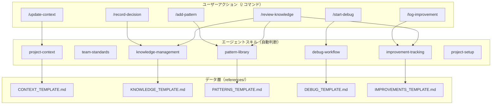

# Cursor AI 知識管理システム 完全ガイド

## 概要

Cursor AI 知識管理システムは、AI 支援開発における知識の蓄積・活用・共有を効率化するためのフレームワークです。エージェントスキル（Agent Skills）とカスタムコマンド（Commands）を活用し、プロジェクト固有の知見を体系的に管理します。

## システムの目的と価値

### 解決する課題
- **属人化**: 個人の知見がチーム全体で共有されない
- **重複作業**: 同じ問題を何度も調査・解決
- **知識の散逸**: プロジェクト終了後に知見が失われる
- **品質のばらつき**: 開発者によるコード品質の差

### 提供する価値
- **知識の体系化**: 技術判断・設計パターンの構造化された管理
- **自動参照**: エージェントスキルによる適切な知識の自動適用
- **即座のアクション**: カスタムコマンドによる迅速な知識記録
- **継続的改善**: 失敗・成功事例の蓄積による品質向上
- **チーム標準化**: 一貫した開発プロセスの確立

## システム設計思想

### .cursor/rules から Skills + Commands への転換

v2.x まで採用していた `.cursor/rules`（MDC 形式）は、ファイルパターンに基づく受動的な知識提供が中心でした。v3.0.0 では以下の課題を解決するため、Agent Skills + Commands に全面移行しています。

- **受動 → 能動**: ルールは情報を提示するだけでしたが、スキルは scripts/ によりタスクを自動実行できます
- **パターンマッチ → 文脈判断**: globs によるファイルパターンから、エージェントが会話の意味を理解した自動適用に進化しました
- **毎回全文送信 → オンデマンド読み込み**: alwaysApply で常に全文を送信していた方式から、必要なスキルだけを選択し references/ を段階的に読み込む方式に変わり、**トークン消費とコストを大幅に削減**します
- **手動参照 → ワークフロー起動**: `/` コマンドで即座に定型作業を開始でき、知識記録の習慣化を支援します

### 3 層アーキテクチャ

本システムは「コマンド → スキル → データ」の 3 層構造で設計されています。



### Agent Skills 採用の理由

- **公式標準**: Cursor AI 公式のエージェントスキル標準仕様（[agentskills.io](https://agentskills.io)）
- **自動判断**: エージェントが文脈に基づいてスキルを自動選択
- **段階的読み込み**: references/ で必要な情報だけをオンデマンド読み込み
- **実行可能**: scripts/ でタスクを自動化
- **ポータブル**: 標準仕様に準拠し、他のエージェントでも利用可能

### カスタムコマンド採用の理由

- **即座のアクション**: `/` 入力で定型作業を即座に開始
- **ワークフロー標準化**: チーム全体で同じ手順を共有
- **低い学習コスト**: Markdown ファイル 1 つで定義
- **スキルとの連携**: コマンドからスキルの機能を呼び出し

## システム構成

### 基本構造
```
.cursor/
├── skills/                          # エージェントスキル
│   ├── project-context/             # プロジェクト背景・制約
│   │   ├── SKILL.md
│   │   └── references/
│   │       └── CONTEXT_TEMPLATE.md
│   ├── team-standards/              # チーム開発標準
│   │   └── SKILL.md
│   ├── knowledge-management/        # 技術判断記録
│   │   ├── SKILL.md
│   │   ├── scripts/
│   │   │   └── add-entry.sh
│   │   └── references/
│   │       └── KNOWLEDGE_TEMPLATE.md
│   ├── pattern-library/             # 実装パターン管理
│   │   ├── SKILL.md
│   │   ├── scripts/
│   │   │   └── add-pattern.sh
│   │   └── references/
│   │       └── PATTERNS_TEMPLATE.md
│   ├── debug-workflow/              # デバッグワークフロー
│   │   ├── SKILL.md
│   │   ├── scripts/
│   │   │   ├── create-session.sh
│   │   │   └── search-sessions.sh
│   │   └── references/
│   │       └── DEBUG_TEMPLATE.md
│   ├── improvement-tracking/        # 改善活動追跡
│   │   ├── SKILL.md
│   │   ├── scripts/
│   │   │   └── add-improvement.sh
│   │   └── references/
│   │       └── IMPROVEMENTS_TEMPLATE.md
│   └── project-setup/              # セットアップ支援
│       ├── SKILL.md
│       └── scripts/
│           ├── init.sh
│           └── validate.sh
└── commands/                        # カスタムコマンド
    ├── record-decision.md
    ├── add-pattern.md
    ├── start-debug.md
    ├── log-improvement.md
    ├── review-knowledge.md
    └── update-context.md
```

## 知識管理の方法論

### 技術判断の記録

技術判断は `/record-decision` コマンドで記録します:

```markdown
### 2026-02-07 - API 設計方針

#### 判断内容
REST vs GraphQL の選択

#### 検討した選択肢
1. **REST API**
   - メリット: チームの習熟度が高い、シンプル
   - デメリット: Over-fetching の懸念

2. **GraphQL**
   - メリット: 柔軟なデータ取得
   - デメリット: 学習コスト、複雑性

#### 決定と理由
**決定**: REST API を採用
**理由**: チームの習熟度が高く、プロジェクトの複雑さに適している

#### 影響範囲
- API サーバー設計
- フロントエンド通信層
```

### パターンの管理

実装パターンは `/add-pattern` コマンドで登録し、pattern-library スキルが自動的に提案します。

### デバッグの記録

問題発生時は `/start-debug` コマンドでセッションを開始し、debug-workflow スキルが過去の類似問題を検索します。

### 改善の追跡

改善活動は `/log-improvement` コマンドで記録し、improvement-tracking スキルが定期レビューを支援します。

## 効果的な活用のヒント

### 日常の開発フロー

1. **開発開始時**: エージェントが project-context と team-standards を自動参照
2. **技術判断時**: `/record-decision` で判断を即座に記録
3. **実装時**: pattern-library スキルが関連パターンを自動提案
4. **問題発生時**: `/start-debug` でセッション開始、過去事例を検索
5. **改善時**: `/log-improvement` で改善を記録
6. **定期レビュー**: `/review-knowledge` で知識ベースを棚卸し

### 推奨レビュー頻度

| 頻度 | アクション |
|------|-----------|
| 日常 | 技術判断の記録、パターンの追加 |
| 週次 | 新たな記録の確認、ステータス更新 |
| 月次 | パターンと改善の効果測定 |
| 四半期 | 全体の棚卸し、アーキテクチャ決定の振り返り |

## v2.x からの移行

v2.x（`.cursor/rules` 形式）から v3.0.0（Skills + Commands）への移行には 3 つの方法があります:

1. **自動スクリプト**: `migrate-from-rules.sh` で一括移行（推奨）
2. **対話型コマンド**: Cursor チャットで `/migrate-from-rules` を実行
3. **手動移行**: 対応表に従って一つずつ移行

詳細は **[v2.x からの移行ガイド](getting-started/migration-from-rules.md)** を参照してください。

---

**詳細なドキュメント**: [README.md](../README.md) を参照
