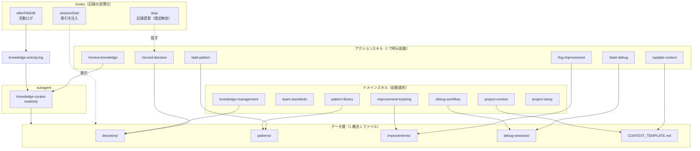

# Cursor Knowledge Management System 完全ガイド

## 概要

CKMS は、AI 支援開発で得た知見をプロジェクト内に蓄積し、次の作業で自動的に活かすためのフレームワークです。Agent Skills を中心に、記録を促す hooks と棚卸し用の subagent を組み合わせています。

## システムの目的と価値

### 解決する課題

- **属人化**: 個人の知見がチーム全体で共有されない
- **重複作業**: 同じ問題を何度も調査・解決する
- **知識の散逸**: プロジェクト終了後に知見が失われる
- **品質のばらつき**: 開発者によるコード品質の差
- **記録が続かない**: 記録の必要性は理解していても、その場で思い出せない

最後の課題が最も重い問題です。仕組みが用意されていても、記録する瞬間が訪れなければ何も蓄積されません。v6 で hooks を導入したのはこのためです。

### 提供する価値

- **知識の体系化**: 技術判断・設計パターンを構造化して管理する
- **自動参照**: エージェントが文脈に応じて適切な知識を読み込む
- **即座のアクション**: `/` の入力ひとつで記録ワークフローを開始する
- **記録の習慣化**: hooks が索引を渡し、記録漏れの手がかりを残す
- **継続的改善**: 失敗・成功事例の蓄積による品質向上
- **チーム標準化**: 一貫した開発プロセスの確立

## 設計思想

### すべてを Agent Skills に統一する（v6）

v5 までは「スキル 7 種 + Cursor 専用コマンド 7 種」という構成でした。コマンドは Cursor 独自の仕組みで、Claude Code や Codex には存在しません。そのため記録ワークフローだけが Cursor に閉じており、配布物も Cursor 用と共通用の 2 つのツリーに分かれて drift していました。

v6 ではコマンドを `disable-model-invocation: true` のスキルに変換し、すべてを `skills/` に統合しました。呼び出し方は `/record-decision` のまま変わらず、対応エージェントが広がり、管理するツリーが 1 つになります。

### `.cursor/rules` から Skills への転換（v3）

v2.x まで採用していた `.cursor/rules`（MDC 形式）は、ファイルパターンに基づく受動的な知識提供が中心でした。v3.0.0 で Agent Skills へ全面移行しています。

- **受動 → 能動**: ルールは情報を提示するだけでしたが、スキルは `scripts/` でタスクを自動実行できます
- **パターンマッチ → 文脈判断**: glob によるファイルパターンから、エージェントが会話の意味を理解した自動適用に変わりました
- **毎回全文送信 → オンデマンド読み込み**: `alwaysApply` で常に全文を送っていた方式から、必要なスキルだけを選び `references/` を段階的に読む方式になりました

### オンデマンド読み込みを実際に成立させる（v6）

上記の「オンデマンド読み込み」は、v5 の実装では成立していませんでした。`add-entry.sh` などが単一の `KNOWLEDGE_TEMPLATE.md` に追記し続ける設計だったため、記録が増えるほど 1 ファイルが肥大化し、参照のたびに全体を読むことになっていたからです。

v6 では 1 概念 1 ファイルに分割し、ディレクトリごとの `README.md` を索引にしました。エージェントはまず索引を読み、関連しそうなファイルだけを開きます。記録が 100 件あっても、実際に読むのは数件で済みます。

## アーキテクチャ

### 全体像


```mermaid
graph TB
    subgraph hooks ["hooks（記録の習慣化）"]
        H1["sessionStart<br/>索引を注入"]
        H2["afterFileEdit<br/>活動ログ"]
        H3["stop<br/>記録提案（既定無効）"]
    end

    subgraph action ["アクションスキル（/ で明示起動）"]
        A1["/record-decision"]
        A2["/add-pattern"]
        A3["/start-debug"]
        A4["/log-improvement"]
        A5["/review-knowledge"]
        A6["/update-context"]
    end

    subgraph domain ["ドメインスキル（自動選択）"]
        SK1["project-context"]
        SK2["team-standards"]
        SK3["knowledge-management"]
        SK4["pattern-library"]
        SK5["debug-workflow"]
        SK6["improvement-tracking"]
        SK7["project-setup"]
    end

    subgraph sub ["subagent"]
        CUR["knowledge-curator<br/>readonly"]
    end

    subgraph data ["データ層（1 概念 1 ファイル）"]
        D1["decisions/"]
        D2["patterns/"]
        D3["improvements/"]
        D4["debug-sessions/"]
        D5["CONTEXT_TEMPLATE.md"]
    end

    H1 -.索引.-> data
    H2 --> LOG["knowledge-activity.log"]
    H3 -.促す.-> A1

    A1 --> D1
    A2 --> D2
    A3 --> D4
    A4 --> D3
    A5 --> CUR
    A6 --> D5

    CUR --> data
    LOG --> CUR

    SK1 --> D5
    SK3 --> D1
    SK4 --> D2
    SK5 --> D4
    SK6 --> D3
```

### 3 つの層の役割

**hooks** はエージェントのライフサイクルに割り込み、記録の起点を作ります。会話の開始時に索引を渡し、編集したファイルを記録し、必要なら記録を促します。ユーザーが何もしなくても動く唯一の層です。

**スキル** は知識の読み書きを担います。ドメインスキルは質問への回答に既存の知識を反映させ、アクションスキルは新しい記録を作ります。

**データ層** は 1 概念 1 ファイルの Markdown です。エージェント固有の形式ではないので、エディタでも GitHub でも普通に読めます。

### なぜ subagent は 1 つだけなのか

`knowledge-curator` だけを提供しています。Cursor の公式ドキュメントは subagent の多用をアンチパターンとしており、委譲のたびにコンテキストの受け渡しコストがかかるためです。

subagent が有効なのは、読み込む量が大きいのに必要な結論が小さい作業です。知識ベースの全走査はこれに該当します。判断 50 件を読むと数万トークンになりますが、欲しいのは「どれを直すべきか」という数十行だけです。逆に記録の追加はユーザーとの往復が必要なので、アクションスキルのままにしています。

## システム構成

### 配布リポジトリ

```text
Cursor-Knowledge-Management-System/
├── skills/                     # スキル 13 種（唯一の正）
│   ├── project-context/
│   ├── team-standards/
│   ├── knowledge-management/
│   ├── pattern-library/
│   ├── debug-workflow/
│   ├── improvement-tracking/
│   ├── project-setup/
│   ├── record-decision/        # 以下 6 種はアクションスキル
│   ├── add-pattern/
│   ├── start-debug/
│   ├── log-improvement/
│   ├── review-knowledge/
│   └── update-context/
├── agents/
│   └── knowledge-curator.md
├── hooks/
│   ├── hooks.json
│   ├── inject-knowledge-index.sh
│   ├── log-activity.sh
│   └── suggest-record.sh
├── .cursor-plugin/plugin.json
├── schemas/                    # 公式スキーマのベンダリング
├── templates/                  # AGENTS.md テンプレートと .cursorignore
├── scripts/                    # CI 検証・リリース
└── docs/
```

配布物を隠しディレクトリではなくルート直下に置いているのは、Cursor Plugin のデフォルト探索、`gh skill install`、`apm install` の 3 経路すべてがこの配置で動くためです。`gh skill` は `--allow-hidden-dirs` なしでは隠しディレクトリ配下を検出しません。

### 導入後のプロジェクト

```text
your-project/
├── .agents/
│   ├── skills/
│   │   ├── knowledge-management/references/decisions/
│   │   │   ├── README.md                        # 索引
│   │   │   └── 2026-06-18-adopt-postgresql.md
│   │   ├── pattern-library/references/patterns/
│   │   └── improvement-tracking/references/improvements/
│   ├── debug-sessions/
│   ├── knowledge-activity.log                   # hooks が生成
│   └── knowledge-hooks.conf                     # hooks の設定（任意）
├── .claude/
│   ├── skills/                                   # .agents/skills へのシンボリックリンク
│   ├── hooks/
│   └── settings.json
├── .cursor/
│   ├── agents/knowledge-curator.md
│   ├── hooks/
│   └── hooks.json
└── .cursorignore
```

`.agents/` はスキルの実体を置く唯一のディレクトリです。Cursor と Codex はこれを直接読みますが、**Claude Code は `.agents/` を標準では探索しない**ため、`.claude/skills` へのシンボリックリンクで橋渡しします（`init.sh` が自動作成）。`.cursor/` に置かれる subagent は Cursor 固有の機能で共有されませんが、補助機能なので無くてもスキルは動作します。hooks は Cursor 版・Claude Code 版の両方を用意しています。

## 知識管理の方法論

### 技術判断の記録

`/record-decision` で記録します。1 判断 1 ファイルで、frontmatter と本文からなります。

```markdown
---
title: API 設計方針として REST を採用
description: GraphQL と比較し、チームの習熟度を優先して REST を選択
tags: [adr]
updated: 2026-06-18
---

# 判断内容

REST と GraphQL のどちらを採用するか

# 検討した選択肢

1. **REST API**
   - メリット: チームの習熟度が高い、シンプル
   - デメリット: Over-fetching の懸念
2. **GraphQL**
   - メリット: 柔軟なデータ取得
   - デメリット: 学習コスト、複雑性

# 決定と理由

**決定**: REST API を採用

**理由**: チームの習熟度が高く、現時点のプロジェクト規模では
Over-fetching が問題になる見込みが薄いため

# 影響範囲

- API サーバー設計
- フロントエンド通信層
```

不採用にした選択肢とその理由を必ず残してください。後から「なぜ GraphQL にしなかったのか」と問われたときに答えられることが、この記録の主な価値です。

### パターンの管理

`/add-pattern` で登録し、`pattern-library` スキルが実装時に提案します。類似パターンが既にある場合は、新規作成より既存への統合が推奨されます。似たパターンが乱立すると、どれを使うべきか分からなくなるためです。

### デバッグの記録

`/start-debug` でセッションを開始します。`debug-workflow` スキルが過去の類似セッションを検索し、調査の経過をファイルに残します。結論だけでなく、そこに至る過程を残すことが重要です。

### 改善の追跡

`/log-improvement` で記録します。ステータスが変わったときはファイル名ではなく frontmatter の `status` を更新してください。ファイル名の日付は「いつ提案したか」を示すもので、リネームすると索引やリンクが壊れます。

### 棚卸し

`/review-knowledge` が `knowledge-curator` に走査を委譲し、陳腐化・矛盾・重複・リンク切れ・記録漏れを報告します。削除ではなくアーカイブが推奨されます。判断の履歴自体に価値があるためです。

## 効果的な活用のヒント

### 日常の開発フロー

1. **会話開始時**: hooks が蓄積済み知識の索引を渡す
2. **開発開始時**: `project-context` と `team-standards` が自動参照される
3. **技術判断時**: `/record-decision` で即座に記録する
4. **実装時**: `pattern-library` が関連パターンを提案する
5. **問題発生時**: `/start-debug` でセッションを開始し、過去事例を検索する
6. **改善時**: `/log-improvement` で記録する
7. **定期レビュー**: `/review-knowledge` で棚卸しする

### 推奨レビュー頻度

| 頻度 | アクション |
|------|-----------|
| 日常 | 技術判断の記録、パターンの追加 |
| 週次 | 新たな記録の確認、ステータス更新 |
| 月次 | パターンと改善の効果測定 |
| 四半期 | 全体の棚卸し、アーキテクチャ決定の振り返り |

### 記録が続かない場合

まず `sessionStart` と `afterFileEdit` の hooks を有効にしてください（既定で有効です）。索引が毎回渡されることで、エージェント側から「この判断は記録しますか」と提案が出るようになります。

それでも続かない場合は `stop` フックを有効にします。ただし 1 ターンを消費するため、2 週間ほど試してから判断することをおすすめします。詳細は [hooks ガイド](advanced/hooks-guide.md) にあります。

## 以前のバージョンからの移行

- v5.x から: [v5 からの移行ガイド](getting-started/migration-from-v5.md)
- v3.x から: [v3 からの移行ガイド](getting-started/migration-from-v3.md)
- v2.x（`.cursor/rules` 形式）から: [v2.x からの移行ガイド](getting-started/migration-from-rules.md)

---

**詳細なドキュメント**: [README.md](../README.md) を参照
