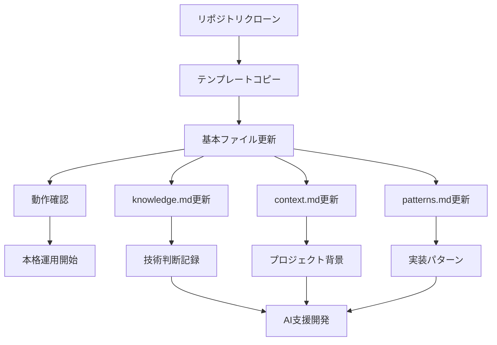

# Getting Started

Cursor AI 知識管理システムの導入を始めるためのガイドです。

## 📋 セクション概要

このセクションでは、システムの導入から基本的な使用方法までを段階的に説明します。

## 🚀 導入手順

### 1. [クイックスタート](quick-start.md)
**5分で始める導入手順**
- リポジトリのクローン
- テンプレートのコピー
- 基本設定の完了
- 動作確認

## 📚 次のステップ

導入が完了したら、以下のセクションに進んでください：

### 📋 [Templates](../templates/README.md)
テンプレートファイルの詳細な使用方法を学習

### 🏢 [Advanced](../advanced/README.md)
チーム導入や高度な使用方法を学習

### 📖 [Reference](../reference/README.md)
技術的な詳細やリファレンス情報を確認

## 🆘 サポート

問題が発生した場合は、以下を確認してください：

1. [トラブルシューティング](../reference/troubleshooting.md)
2. [開発ログ](../reference/development-log.md)
3. [GitHub Issues](https://github.com/shioki/Cursor-Knowledge-Management-System/issues)

---

**💡 ヒント**: 初めて使用する場合は、[クイックスタート](quick-start.md)から始めることをお勧めします。
