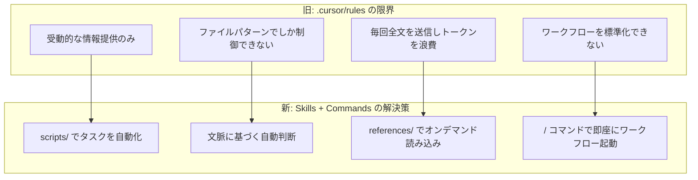
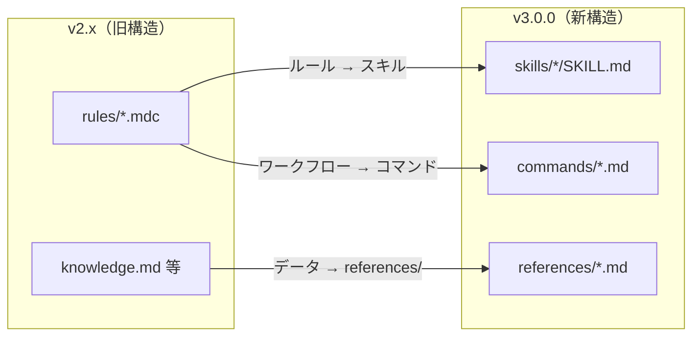

# v2.x（.cursor/rules）からの移行ガイド

## 概要

このガイドでは、v2.x（`.cursor/rules` 形式）から v3.0.0（Agent Skills + Commands 形式）への移行方法を解説します。

## なぜ移行するのか

### .cursor/rules の限界

v2.x の `.cursor/rules`（MDC 形式）は Cursor の知識管理において大きな役割を果たしてきましたが、実際の運用では以下の限界がありました。

**1. 受動的な知識提供にとどまる**

ルールは「エージェントに情報を渡す」ことしかできません。ファイルの作成、検索、記録といった**アクション**を自動化する手段がないため、知識の記録は常にユーザーの手作業に頼らざるを得ませんでした。

**2. globs パターンマッチの粗さ**

`globs: "**/*.{ts,tsx}"` のようなファイルパターンで適用を制御する仕組みは、「TypeScript ファイルを開いたらルールを適用する」程度の粒度しか実現できません。「ユーザーがデバッグに困っている」「技術判断を議論している」といった**文脈に基づいた判断**はできませんでした。

**3. トークン消費の非効率さ**

`alwaysApply: true` に設定されたルールは、内容の関連性に関係なく**毎回すべてのリクエストに含まれ**ます。globs でマッチしたルールも同様に、ファイルを開いているだけで読み込まれます。さらに `.cursor/knowledge.md` のような単一ファイルは丸ごと渡されるため、プロジェクトが成長するほど**不要なトークンが積み重なり、コストが増大**していました。

**4. ワークフローの標準化が困難**

「技術判断を記録する」「デバッグセッションを開始する」といった繰り返しの作業に対して、ルールは手順を示すことしかできず、**定型ワークフローとして起動する仕組み**がありませんでした。

### Agent Skills + Commands が解決すること



**1. 自動化の実現（scripts/）**

スキルにはシェルスクリプトを含めることができます。技術判断の記録テンプレート作成、デバッグセッションファイルの生成、過去の類似問題の検索といった作業を**エージェントが自動実行**できるようになります。

**2. 文脈ベースの自動判断**

エージェントは `description` フィールドに基づいて、会話の文脈からどのスキルが適切かを自動判断します。「バグの原因を調べて」と言えば debug-workflow スキルが、「この API の設計方針は？」と聞けば knowledge-management スキルが自動的に適用されます。ファイルパターンよりも**意味のある粒度**で動作します。

**3. トークン消費の最適化（references/）**

スキルでは、エージェントが文脈から必要なスキルだけを選択し、不要なスキルは読み込みません。さらに詳細情報は `references/` ディレクトリに分離されており、**必要になった時点でオンデマンドに読み込まれ**ます。SKILL.md 本体は軽量に保たれるため、`alwaysApply` で毎回全文を送信していた旧方式と比べて**トークン消費とコストを大幅に削減**できます。

**4. 定型ワークフローの即時起動（commands/）**

カスタムコマンドにより、チャットで `/record-decision` と入力するだけで技術判断の記録ワークフローが開始されます。チーム全体で同じ手順を共有でき、**知識記録のハードルが大幅に下がります**。

### 移行によって得られる具体的なメリット

| 場面 | 旧（rules） | 新（skills + commands） |
|------|-------------|----------------------|
| トークン消費 | alwaysApply で毎回全文を送信 | 必要なスキルだけを選択的に読み込み |
| 技術判断の記録 | knowledge.md を手動で開いて書く | `/record-decision` で対話的に記録 |
| バグ調査 | 過去ログを自分で探す | `/start-debug` で類似問題を自動検索 |
| パターンの適用 | patterns.md を手動で参照 | エージェントが実装時に自動提案 |
| 知識の定期レビュー | 忘れがち | `/review-knowledge` で構造的にレビュー |
| 新メンバーのオンボーディング | 「このファイルを読んで」 | スキルが自動で関連知識を提供 |

### オープンスタンダードへの準拠

Agent Skills は Cursor 独自の仕組みではなく、[agentskills.io](https://agentskills.io) で定義されたオープンスタンダードです。この標準に準拠することで、将来的に他のエージェント対応エディタやツールでも同じスキルを利用できる**ポータビリティ**が確保されます。

## 何が変わったか

### 変更の全体像



### 変更の理由

| 観点 | v2.x（rules） | v3.0.0（skills + commands） |
|------|--------------|---------------------------|
| 適用方法 | ファイルパターンマッチ（globs） | エージェントが文脈から自動判断 |
| 自動化 | なし | scripts/ でタスクを自動化 |
| ドキュメント管理 | 単一 .md ファイル | references/ で段階的読み込み |
| ワークフロー | 手動で参照 | `/` コマンドで即座に起動 |
| 標準仕様 | Cursor 独自形式 | Agent Skills 標準仕様準拠 |

## 旧→新の対応表

### ルール → スキル

| 旧ルール（.mdc） | 新スキル | 備考 |
|-----------------|---------|------|
| `project-context.mdc` | `skills/project-context/` | alwaysApply → エージェント自動判断 |
| `team-standards.mdc` | `skills/team-standards/` | 規約内容を SKILL.md に統合 |
| `knowledge-management.mdc` | `skills/knowledge-management/` | scripts/ で記録自動化を追加 |
| `patterns-library.mdc` | `skills/pattern-library/` | scripts/ でパターン追加を自動化 |
| `debug-workflow.mdc` | `skills/debug-workflow/` | debug-support.mdc と統合 |
| `debug-support.mdc` | `skills/debug-workflow/` | debug-workflow.mdc と統合 |
| `improvement-tracking.mdc` | `skills/improvement-tracking/` | scripts/ で改善記録を自動化 |

### データファイル → references/

| 旧ファイル | 新ファイル |
|-----------|-----------|
| `.cursor/knowledge.md` | `skills/knowledge-management/references/KNOWLEDGE_TEMPLATE.md` |
| `.cursor/patterns.md` | `skills/pattern-library/references/PATTERNS_TEMPLATE.md` |
| `.cursor/context.md` | `skills/project-context/references/CONTEXT_TEMPLATE.md` |
| `.cursor/debug-log.md` | `skills/debug-workflow/references/DEBUG_TEMPLATE.md` |
| `.cursor/improvements.md` | `skills/improvement-tracking/references/IMPROVEMENTS_TEMPLATE.md` |

### 新しいコマンド（v2.x に対応するものなし）

| コマンド | 機能 |
|----------|------|
| `/record-decision` | 技術判断を対話形式で記録 |
| `/add-pattern` | 実装パターンを登録 |
| `/start-debug` | デバッグセッションを開始 |
| `/log-improvement` | 改善内容を記録 |
| `/review-knowledge` | 知識ベースの定期レビュー |
| `/update-context` | コンテキスト情報を更新 |
| `/migrate-from-rules` | v2.x からの移行を支援 |

## 移行方法

3 つの方法から選べます。

### 方法 1: 自動スクリプトで移行（推奨）

最も簡単な方法です。スクリプトが旧ファイルのバックアップ、データの転記、旧ファイルの削除を自動で行います。

```bash
# 1. 新しいテンプレートを取得
git clone https://github.com/shioki/Cursor-Knowledge-Management-System.git
cd Cursor-Knowledge-Management-System

# 2. マイグレーションスクリプトを実行
bash templates/.cursor/skills/project-setup/scripts/migrate-from-rules.sh /path/to/your-project
```

スクリプトが行うこと:
1. 旧ファイルを `.cursor/backup-v2/` にバックアップ
2. 新しい skills/ と commands/ をコピー
3. 旧データファイルの内容を新しい references/ に転記
4. 旧 rules/ ディレクトリを削除（確認付き）
5. 移行結果のレポートを出力

### 方法 2: コマンドで対話的に移行

Cursor のチャットでエージェントと対話しながら移行する方法です。

1. まず新しいテンプレートの skills/ と commands/ を手動でコピー
2. Cursor のチャットで `/migrate-from-rules` と入力
3. エージェントが旧ファイルを検出し、対話形式で移行を支援

### 方法 3: 手動で移行

自分のペースで一つずつ移行する方法です。

#### Step 1: 新しい skills/ と commands/ をコピー

```bash
# Mac/Linux
cp -r templates/.cursor/skills /path/to/your-project/.cursor/skills
cp -r templates/.cursor/commands /path/to/your-project/.cursor/commands
find /path/to/your-project/.cursor/skills -name "*.sh" -exec chmod +x {} \;

# Windows (PowerShell)
Copy-Item -Path "templates\.cursor\skills" -Destination "/path/to/your-project\.cursor\skills" -Recurse
Copy-Item -Path "templates\.cursor\commands" -Destination "/path/to/your-project\.cursor\commands" -Recurse
```

#### Step 2: 既存データを新しい references/ に転記

旧ファイルに記録していた実際のデータを、対応する新しい references/ ファイルにコピーしてください。

例: `.cursor/knowledge.md` に以下の記録があった場合:
```markdown
## 設計判断の記録

### 2025-06-15 - API設計方針
#### 判断内容
REST vs GraphQL の選択
...
```

これを `.cursor/skills/knowledge-management/references/KNOWLEDGE_TEMPLATE.md` の「設計判断の記録」セクションに転記します。

#### Step 3: カスタマイズしたルール内容を保存

`team-standards.mdc` にプロジェクト固有の規約を書いていた場合は、その内容を `.cursor/skills/team-standards/SKILL.md` の該当セクションに反映してください。

#### Step 4: 旧ファイルを削除

すべてのデータ転記が完了したら、旧ファイルを削除します:

```bash
rm -rf .cursor/rules/
rm -f .cursor/knowledge.md .cursor/patterns.md .cursor/context.md
rm -f .cursor/debug-log.md .cursor/improvements.md
```

#### Step 5: 動作確認

```bash
# 構造検証
bash .cursor/skills/project-setup/scripts/validate.sh

# Cursor Settings > Rules でスキルが検出されることを確認
# チャットで / を入力してコマンドが表示されることを確認
```

## カスタムルールの移行

v2.x で独自のルールを追加していた場合の移行方法:

### alwaysApply: true のルール → スキル

常時適用ルールは、description を充実させたスキルに変換します:

```yaml
# 旧: .cursor/rules/my-rule.mdc
---
description: "常に適用するルール"
globs: "**/*"
alwaysApply: true
---
# ルール内容...
```

```yaml
# 新: .cursor/skills/my-rule/SKILL.md
---
name: my-rule
description: このスキルが適用される場面の詳細な説明。エージェントはこの説明に基づいて自動判断します。
---
# スキル内容...
```

### globs ベースのルール → スキル

ファイルパターンで自動適用していたルールは、description にパターン情報を含めます:

```yaml
# 旧: globs: "**/*.{ts,tsx}"

# 新: description に「TypeScript ファイルの編集時に使用」と記載
```

### 手動参照のルール → disable-model-invocation スキル

手動で参照していたルールは、自動適用を無効にしたスキルに変換します:

```yaml
---
name: special-operation
description: 特殊な操作を行うスキル
disable-model-invocation: true
---
```

## よくある質問

**Q: alwaysApply: true のルールは、スキルだと常時適用されない？**
A: スキルではエージェントが description に基づいて自動判断します。description を充実させることで、必要な場面で確実に適用されます。「常にすべての場面で必要」な情報は SKILL.md に直接記載してください。

**Q: globs パターンによる自動適用が使えなくなる？**
A: はい。代わりにエージェントが文脈から判断します。description に「TypeScript ファイルの編集時に使用」のように記載することで、同等の効果が得られます。

**Q: 旧データは消える？**
A: 自動スクリプトを使う場合、旧ファイルは `.cursor/backup-v2/` にバックアップされます。手動移行の場合は、削除前に必ずバックアップを取ってください。

**Q: 移行後に元に戻せる？**
A: `.cursor/backup-v2/` からいつでも復元できます。新しい skills/ と commands/ を削除し、バックアップから rules/ とデータファイルを復元すれば v2.x の状態に戻ります。

**Q: 一部だけ先に移行できる？**
A: はい。skills/ と rules/ は共存可能です。段階的に移行し、すべてのルールをスキルに変換した後で rules/ を削除できます。

## 次のステップ

移行が完了したら:

- [スキルとコマンドの概要](skills-and-commands.md) - 新しい仕組みの理解
- [スキルガイド](../templates/skills-guide.md) - 各スキルの使い方
- [コマンドガイド](../templates/commands-guide.md) - 各コマンドの使い方
- [カスタムスキル・コマンド作成](../advanced/custom-skills.md) - 独自スキルの作り方

---

**サポート**: 移行で問題が発生した場合は、Cursor のチャットで `/migrate-from-rules` コマンドを使用してエージェントに支援を依頼できます。
