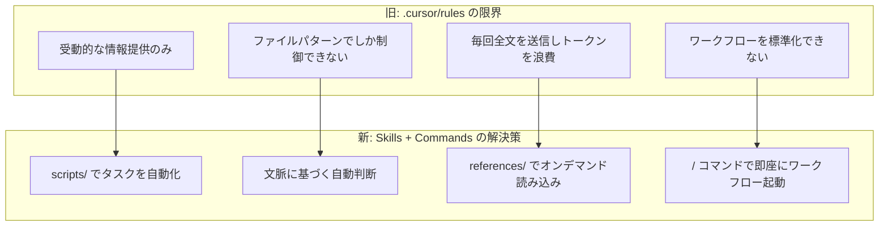
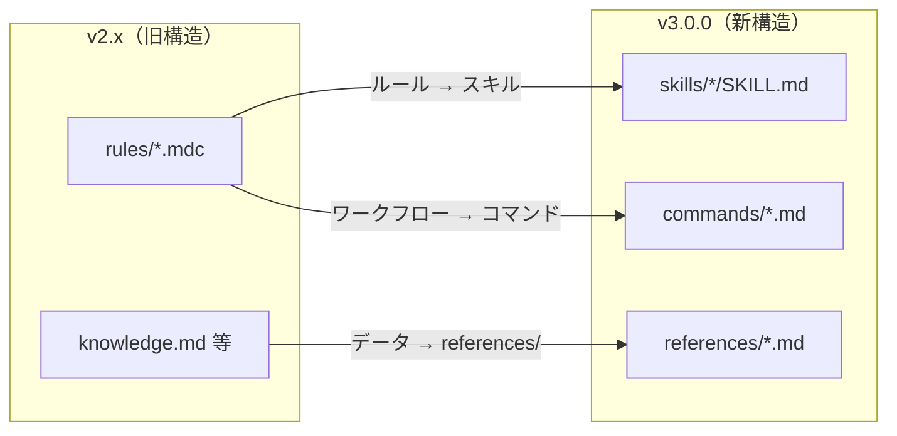

# v2.x（.cursor/rules）からの移行ガイド

## 概要

このガイドでは、v2.x（`.cursor/rules` 形式）から現行の Agent Skills 形式への移行方法を解説します。

> **注**: v2.x の構成はかなり古いものです。以下の説明は v3.0.0 の転換を軸にしていますが、実際の移行先は最新の v6.0.0 になります。v6 ではコマンドもスキルに統合されているため、本ガイドの「コマンド」はすべてアクションスキルに読み替えてください。

## なぜ移行するのか

### .cursor/rules の限界

v2.x の `.cursor/rules`（MDC 形式）は Cursor の知識管理において大きな役割を果たしてきましたが、実際の運用では以下の限界がありました。

**1. 受動的な知識提供にとどまる**

ルールは「エージェントに情報を渡す」ことしかできません。ファイルの作成、検索、記録といった**アクション**を自動化する手段がないため、知識の記録は常にユーザーの手作業に頼らざるを得ませんでした。

**2. globs パターンマッチの粗さ**

`globs: "**/*.{ts,tsx}"` のようなファイルパターンで適用を制御する仕組みは、「TypeScript ファイルを開いたらルールを適用する」程度の粒度しか実現できません。「ユーザーがデバッグに困っている」「技術判断を議論している」といった**文脈に基づいた判断**はできませんでした。

**3. トークン消費の非効率さ**

`alwaysApply: true` に設定されたルールは、内容の関連性に関係なく**毎回すべてのリクエストに含まれ**ます。globs でマッチしたルールも同様に、ファイルを開いているだけで読み込まれます。さらに `.cursor/knowledge.md` のような単一ファイルは丸ごと渡されるため、プロジェクトが成長するほど**不要なトークンが積み重なり、コストが増大**していました。

**4. ワークフローの標準化が困難**

「技術判断を記録する」「デバッグセッションを開始する」といった繰り返しの作業に対して、ルールは手順を示すことしかできず、**定型ワークフローとして起動する仕組み**がありませんでした。

### Agent Skills + Commands が解決すること


```mermaid
graph TB
    subgraph limits ["旧: .cursor/rules の限界"]
        L1["受動的な情報提供のみ"]
        L2["ファイルパターンでしか制御できない"]
        L3["毎回全文を送信しトークンを浪費"]
        L4["ワークフローを標準化できない"]
    end

    subgraph solutions ["新: Skills + Commands の解決策"]
        S1["scripts/ でタスクを自動化"]
        S2["文脈に基づく自動判断"]
        S3["references/ でオンデマンド読み込み"]
        S4["/ コマンドで即座にワークフロー起動"]
    end

    L1 --> S1
    L2 --> S2
    L3 --> S3
    L4 --> S4
```

**1. 自動化の実現（scripts/）**

スキルにはシェルスクリプトを含めることができます。技術判断の記録テンプレート作成、デバッグセッションファイルの生成、過去の類似問題の検索といった作業を**エージェントが自動実行**できるようになります。

**2. 文脈ベースの自動判断**

エージェントは `description` フィールドに基づいて、会話の文脈からどのスキルが適切かを自動判断します。「バグの原因を調べて」と言えば debug-workflow スキルが、「この API の設計方針は？」と聞けば knowledge-management スキルが自動的に適用されます。ファイルパターンよりも**意味のある粒度**で動作します。

**3. トークン消費の最適化（references/）**

スキルでは、エージェントが文脈から必要なスキルだけを選択し、不要なスキルは読み込みません。さらに詳細情報は `references/` ディレクトリに分離されており、**必要になった時点でオンデマンドに読み込まれ**ます。SKILL.md 本体は軽量に保たれるため、`alwaysApply` で毎回全文を送信していた旧方式と比べて**トークン消費とコストを大幅に削減**できます。

**4. 定型ワークフローの即時起動（commands/）**

カスタムコマンドにより、チャットで `/record-decision` と入力するだけで技術判断の記録ワークフローが開始されます。チーム全体で同じ手順を共有でき、**知識記録のハードルが大幅に下がります**。

### 移行によって得られる具体的なメリット

| 場面 | 旧（rules） | 新（skills + commands） |
|------|-------------|----------------------|
| トークン消費 | alwaysApply で毎回全文を送信 | 必要なスキルだけを選択的に読み込み |
| 技術判断の記録 | knowledge.md を手動で開いて書く | `/record-decision` で対話的に記録 |
| バグ調査 | 過去ログを自分で探す | `/start-debug` で類似問題を自動検索 |
| パターンの適用 | patterns.md を手動で参照 | エージェントが実装時に自動提案 |
| 知識の定期レビュー | 忘れがち | `/review-knowledge` で構造的にレビュー |
| 新メンバーのオンボーディング | 「このファイルを読んで」 | スキルが自動で関連知識を提供 |

### オープンスタンダードへの準拠

Agent Skills は Cursor 独自の仕組みではなく、[agentskills.io](https://agentskills.io) で定義されたオープンスタンダードです。この標準に準拠することで、将来的に他のエージェント対応エディタやツールでも同じスキルを利用できる**ポータビリティ**が確保されます。

## 何が変わったか

### 変更の全体像


```mermaid
graph LR
    subgraph v2x ["v2.x（旧構造）"]
        R["rules/*.mdc"]
        D["knowledge.md 等"]
    end

    subgraph v3 ["v3.0.0（新構造）"]
        S["skills/*/SKILL.md"]
        C["commands/*.md"]
        Ref["references/*.md"]
    end

    R -->|"ルール → スキル"| S
    D -->|"データ → references/"| Ref
    R -->|"ワークフロー → コマンド"| C
```

### 変更の理由

| 観点 | v2.x（rules） | v3.0.0（skills + commands） |
|------|--------------|---------------------------|
| 適用方法 | ファイルパターンマッチ（globs） | エージェントが文脈から自動判断 |
| 自動化 | なし | scripts/ でタスクを自動化 |
| ドキュメント管理 | 単一 .md ファイル | references/ で段階的読み込み |
| ワークフロー | 手動で参照 | `/` コマンドで即座に起動 |
| 標準仕様 | Cursor 独自形式 | Agent Skills 標準仕様準拠 |

## 旧→新の対応表

### ルール → スキル

| 旧ルール（.mdc） | 新スキル | 備考 |
|-----------------|---------|------|
| `project-context.mdc` | `skills/project-context/` | alwaysApply → エージェント自動判断 |
| `team-standards.mdc` | `skills/team-standards/` | 規約内容を SKILL.md に統合 |
| `knowledge-management.mdc` | `skills/knowledge-management/` | scripts/ で記録自動化を追加 |
| `patterns-library.mdc` | `skills/pattern-library/` | scripts/ でパターン追加を自動化 |
| `debug-workflow.mdc` | `skills/debug-workflow/` | debug-support.mdc と統合 |
| `debug-support.mdc` | `skills/debug-workflow/` | debug-workflow.mdc と統合 |
| `improvement-tracking.mdc` | `skills/improvement-tracking/` | scripts/ で改善記録を自動化 |

### データファイル → references/

| 旧ファイル | 新ファイル |
|-----------|-----------|
| `.cursor/knowledge.md` | `skills/knowledge-management/references/KNOWLEDGE_TEMPLATE.md` |
| `.cursor/patterns.md` | `skills/pattern-library/references/PATTERNS_TEMPLATE.md` |
| `.cursor/context.md` | `skills/project-context/references/CONTEXT_TEMPLATE.md` |
| `.cursor/debug-log.md` | `skills/debug-workflow/references/DEBUG_TEMPLATE.md` |
| `.cursor/improvements.md` | `skills/improvement-tracking/references/IMPROVEMENTS_TEMPLATE.md` |

### 新しいコマンド（v2.x に対応するものなし）

| コマンド | 機能 |
|----------|------|
| `/record-decision` | 技術判断を対話形式で記録 |
| `/add-pattern` | 実装パターンを登録 |
| `/start-debug` | デバッグセッションを開始 |
| `/log-improvement` | 改善内容を記録 |
| `/review-knowledge` | 知識ベースの定期レビュー |
| `/update-context` | コンテキスト情報を更新 |

v3 には `/migrate-from-rules` コマンドもありましたが、Cursor 組み込みの `/migrate-to-skills` と役割が重複するため v6 で廃止しました。

## 移行方法

2 つの方法から選べます。専用の移行スクリプトは v6 で廃止したため、標準の `init.sh` でスキルを配置してから、データを手作業で転記する流れになります。

### 方法 1: init.sh で配置してから転記（推奨）

```bash
# 1. 新しいテンプレートを取得
git clone https://github.com/shioki/Cursor-Knowledge-Management-System.git
cd Cursor-Knowledge-Management-System

# 2. 旧ファイルをバックアップ
cp -r /path/to/your-project/.cursor /path/to/your-project/.cursor-backup-v2

# 3. スキル一式を配置
bash skills/project-setup/scripts/init.sh /path/to/your-project
```

配置後、次節の対応表に従って旧データを転記し、`.cursor/rules/` と旧データファイルを削除します。バックアップを取ってあるので、転記漏れがあっても復元できます。

### 方法 2: エージェントに転記を任せる

Cursor のチャットで、旧ファイルの内容を新しい構造へ移すよう依頼する方法です。

1. 方法 1 の手順 1〜3 でスキルを配置する
2. チャットで「`.cursor-backup-v2/knowledge.md` の記録を `/record-decision` の形式で個別ファイルに分割して」のように依頼する
3. 生成結果を確認してから旧ファイルを削除する

記録が多い場合は、価値の高いものだけを選んで移すのが現実的です。半年以上参照していない記録は、バックアップに残したままで構いません。

### 転記の手順

#### Step 1: 既存データを個別ファイルに転記

旧ファイルの記録を、1 判断 1 ファイルの形式に分割します。

例: `.cursor/knowledge.md` に以下の記録があった場合:

```markdown
## 設計判断の記録

### 2025-06-15 - API設計方針
#### 判断内容
REST vs GraphQL の選択
...
```

これは `.agents/skills/knowledge-management/references/decisions/2025-06-15-api-design.md` として保存し、`decisions/README.md` の一覧に 1 行追加します。`/record-decision` を使えば、ファイル生成と索引更新が自動で行われます。

#### Step 2: カスタマイズしたルール内容を保存

`team-standards.mdc` にプロジェクト固有の規約を書いていた場合は、その内容を `.agents/skills/team-standards/SKILL.md` の該当セクションに反映してください。

#### Step 3: 旧ファイルを削除

すべてのデータ転記が完了したら、旧ファイルを削除します。

```bash
rm -rf .cursor/rules/
rm -f .cursor/knowledge.md .cursor/patterns.md .cursor/context.md
rm -f .cursor/debug-log.md .cursor/improvements.md
```

#### Step 4: 動作確認

```bash
bash .agents/skills/project-setup/scripts/validate.sh
```

あわせて、Cursor の Settings > Rules でスキルが検出されること、チャットで `/` を入力してアクションスキルが候補に出ることを確認してください。

## カスタムルールの移行

v2.x で独自のルールを追加していた場合の移行方法:

### alwaysApply: true のルール → スキル

常時適用ルールは、description を充実させたスキルに変換します:

```yaml
# 旧: .cursor/rules/my-rule.mdc
---
description: "常に適用するルール"
globs: "**/*"
alwaysApply: true
---
# ルール内容...
```

```yaml
# 新: .agents/skills/my-rule/SKILL.md
---
name: my-rule
description: このスキルが適用される場面の詳細な説明。エージェントはこの説明に基づいて自動判断します。
---
# スキル内容...
```

### globs ベースのルール → スキル

ファイルパターンで自動適用していたルールは、description にパターン情報を含めます:

```yaml
# 旧: globs: "**/*.{ts,tsx}"

# 新: description に「TypeScript ファイルの編集時に使用」と記載
```

### 手動参照のルール → アクションスキル

手動で参照していたルールは、自動適用を無効にしたスキル（アクションスキル）に変換します。`/special-operation` で明示的に呼び出せます。

```yaml
---
name: special-operation
description: 特殊な操作を行うスキル
disable-model-invocation: true
---
```

v6 の `/record-decision` などは、すべてこの形式で実装されています。書き方は [アクションスキルガイド](../templates/action-skills-guide.md) を参照してください。

## よくある質問

**Q: alwaysApply: true のルールは、スキルだと常時適用されない？**
A: スキルではエージェントが description に基づいて自動判断します。description を充実させることで、必要な場面で確実に適用されます。「常にすべての場面で必要」な情報は SKILL.md に直接記載してください。

**Q: globs パターンによる自動適用が使えなくなる？**
A: はい。代わりにエージェントが文脈から判断します。description に「TypeScript ファイルの編集時に使用」のように記載することで、同等の効果が得られます。

**Q: 旧データは消える？**
A: `init.sh` は `.cursor/rules/` や旧データファイルに触れません。削除は手作業なので、その前に必ずバックアップを取ってください。

**Q: 移行後に元に戻せる？**
A: バックアップを取ってあれば戻せます。`.agents/skills/` を削除し、バックアップから `rules/` とデータファイルを復元すれば v2.x の状態になります。

**Q: 一部だけ先に移行できる？**
A: はい。`.agents/skills/` と `.cursor/rules/` は共存できます。段階的に移行し、すべてのルールをスキルに変換した後で `rules/` を削除してください。

## 次のステップ

移行が完了したら:

- [スキルの全体像](skills-and-commands.md) - 新しい仕組みの理解
- [スキルガイド](../templates/skills-guide.md) - ドメインスキル 7 種の使い方
- [アクションスキルガイド](../templates/action-skills-guide.md) - `/record-decision` 等の使い方
- [カスタムスキル作成](../advanced/custom-skills.md) - 独自スキルの作り方
- [hooks ガイド](../advanced/hooks-guide.md) - 記録を習慣にする仕組み

---

**サポート**: 移行で問題が発生した場合は、Cursor のチャットで旧ファイルのパスを示して支援を依頼してください。Cursor 組み込みの `/migrate-to-skills` も、ルールからスキルへの変換に利用できます。
