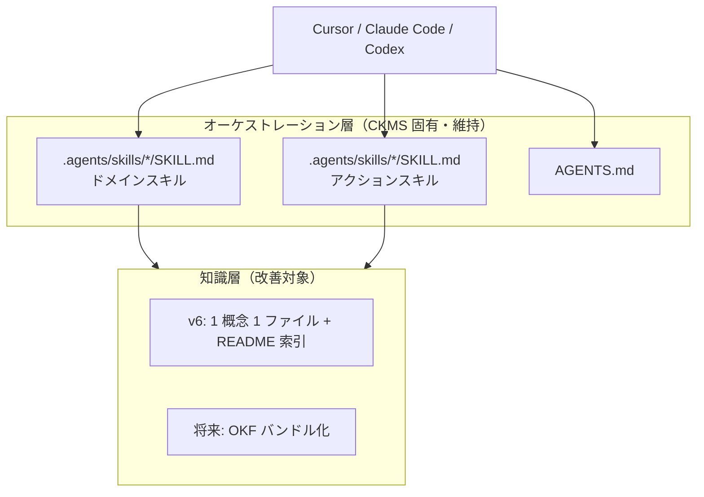

# OKF 調査と知識形式の改善方針

本ドキュメントは、Google Cloud が提唱する **Open Knowledge Format（OKF）** の調査結果と、CKMS における今後の知識管理の方針を記録したものです。

## 背景

2026 年 6 月、Google Cloud は **Open Knowledge Format（OKF）v0.1** を公開しました。OKF は、AI エージェント向けのキュレーション済み知識を **Markdown + YAML frontmatter** のディレクトリバンドルとして表現する、ベンダーニュートラルなオープン仕様です。

| 項目 | 内容 |
|------|------|
| 正式名称 | Open Knowledge Format（略称: OKF） |
| 現行バージョン | v0.1（ドラフト） |
| 必須フィールド | `type`（1 概念 = 1 ファイル） |
| 推奨フィールド | `title`, `description`, `resource`, `tags`, `timestamp` |
| 予約ファイル名 | `index.md`（目次）, `log.md`（変更履歴） |
| 仕様 | [GoogleCloudPlatform/knowledge-catalog/okf/SPEC.md](https://github.com/GoogleCloudPlatform/knowledge-catalog/blob/main/okf/SPEC.md) |
| 解説 | [Google Cloud ブログ（2026-06-12）](https://cloud.google.com/blog/products/data-analytics/how-the-open-knowledge-format-can-improve-data-sharing) |

Google は OKF を **Obsidian、Karpathy の LLM Wiki、AGENTS.md / CLAUDE.md 系** と同系統の「LLM Wiki パターン」の標準化として位置づけています。CKMS も同じ思想（Markdown 知識ベース + エージェントによる段階的読込）を採用しているため、将来的な親和性は高いです。

## CKMS との関係

CKMS は **3 層構造** で動作します。OKF が対象とするのは主に **知識層（references/）** です。



| 層 | CKMS の役割 | OKF との関係 |
|----|------------|-------------|
| Skills | いつ・どう知識を使うか | 対象外（エージェント側の仕様） |
| AGENTS.md | 常時参照の基本方針 | 前身パターンとして Google が言及 |
| references/ | 技術判断・パターン等の蓄積 | **OKF バンドル化の候補** |

v6 で知識層を 1 概念 1 ファイル + `README.md` 索引に分割したため、OKF が求める粒度にかなり近づきました。残る差分は `id` / `type` などの必須フィールドと、予約ファイル名（`index.md` / `log.md`）の扱いです。

## 方針: OKF v1.0 まで様子見

**現時点では OKF への正式対応は見送り、v1.0（メジャー）リリースとエコシステムの成熟を待つ** ことを CKMS の方針とします。

### 様子見と判断する理由

1. **v0.1 はドラフト** — 仕様・慣習がまだ固まりきっていない
2. **CKMS は現行構成で実用可能** — v6 で 1 概念 1 ファイル + 索引方式に移行済みで、運用上の不足はない
3. **移行コストに対する即時リターンが限定的** — 外部 OKF Consumer（Google Knowledge Catalog 等）を使わない限り、恩恵は主に構造化・検索性の改善に留まる
4. **後方互換の移行パスを確保できる** — 本ドキュメント後半の OKF 非依存改善を v6 で適用済みのため、v1.0 時にスムーズに載せ替えられる

### 再検討のトリガー

次のいずれかが起きたら、OKF 正式対応を Issue / ロードマップで再評価してください。

- OKF **v1.0** のリリース（破壊的変更方針の明文化）
- Cursor / Claude Code 等が OKF を **ネイティブサポート**
- チームで **Google Knowledge Catalog** 等の OKF Consumer を本番利用開始
- 複数プロジェクト間で **知識バンドルの共有** が課題化

---

## OKF 非依存の軽量改善（v6.0.0 で適用済み）

OKF v1.0 を待つ間の「仕様に依存しない改善」として本節が提案していた内容は、**v6.0.0 で標準実装になりました**。`/record-decision` などのアクションスキルは最初から個別ファイルを生成し、`README.md` 索引を自動更新します。以下は、その設計の根拠と、独自にカスタマイズする際の規約として残しています。

### 改善の 3 原則

| 原則 | 内容 | OKF との対応 |
|------|------|-------------|
| **1 概念 1 ファイル** | 判断・パターン・デバッグ記録を個別 Markdown に分離 | OKF の基本単位と同一 |
| **Markdown リンク** | 関連知識どうしを明示的に接続 | OKF のクロスリンク規約とほぼ同一 |
| **目次による段階的開示** | カテゴリごとに `README.md` または `index.md` を置く | OKF の `index.md` に近い |

### ディレクトリ構造（v6 の実装）

`references/` 配下にカテゴリごとのサブディレクトリを置き、それぞれの `README.md` を索引にします。`*_TEMPLATE.md` は v5 以前の記録を保持するレガシーファイルとして残ります。

```text
.agents/
├── skills/
│   ├── knowledge-management/references/
│   │   ├── KNOWLEDGE_TEMPLATE.md      # レガシー（v5 以前の記録）
│   │   └── decisions/
│   │       ├── README.md              # 索引（スクリプトが自動更新）
│   │       └── 2026-06-18-use-postgresql.md
│   ├── pattern-library/references/
│   │   ├── PATTERNS_TEMPLATE.md
│   │   └── patterns/
│   │       ├── README.md
│   │       └── api-error-handling.md
│   ├── improvement-tracking/references/
│   │   ├── IMPROVEMENTS_TEMPLATE.md
│   │   └── improvements/
│   │       ├── README.md
│   │       └── 2026-06-20-refactor-auth-module.md
│   └── project-context/references/
│       └── CONTEXT_TEMPLATE.md        # 単一ファイルのまま（更新頻度が低く分割の利得が小さい）
└── debug-sessions/
    └── 2026-06-10-auth-timeout.md
```

デバッグセッションだけは `.agents/debug-sessions/` に置き、スキル配下ではありません。作業中の一時記録という性格が強く、`.cursorignore` で個人用セッションを除外しやすくするためです。

> **注**: `.claude/skills/` / `.cursor/skills/` を使うプロジェクトでも、同じ相対パス構造が適用されます。

### ファイル命名規則

| カテゴリ | ディレクトリ | 命名例 | 備考 |
|---------|-------------|--------|------|
| 技術判断（ADR） | `decisions/` | `YYYY-MM-DD-短いスラッグ.md` | 日付でソート可能 |
| 実装パターン | `patterns/` | `機能-パターン名.md` | 日付を付けない（パターンは更新され続けるため） |
| デバッグセッション | `.agents/debug-sessions/` | `YYYY-MM-DD-問題の要約.md` | 調査開始日を先頭に |
| 改善記録 | `improvements/` | `YYYY-MM-DD-改善タイトル.md` | 完了後もファイル名は変えない |

スラッグは **英数字とハイフン** に統一します。スクリプトが日本語タイトルを自動でスラッグ化しますが、変換結果が空になる場合はタイムスタンプにフォールバックします。読みやすいファイル名にしたい場合は、英語のスラッグを明示的に指定してください。本文は日本語で記述して問題ありません。

改善記録のファイル名を変えないのは、日付が「いつ提案したか」を示すためです。ステータスが変わったときは frontmatter の `status` を更新します。リネームすると索引や既存のリンクが壊れます。

### frontmatter（v6 のスクリプトが自動生成）

`add-entry.sh` などが以下の形式で frontmatter を生成します。OKF 準拠は必須ではありませんが、将来の移行を意識した軽量な形にしてあります。

`title` はユーザー入力をそのまま書かず、ダブルクォートで囲みます（`|` や `:` や `"` を含むタイトルで YAML が壊れないようにするため。実装は `ckms_yaml_escape`）。

```markdown
---
title: "PostgreSQL を採用した理由"
description: "" # 1 行サマリを記入
tags: [database, adr]
updated: 2026-06-18
---

# 判断内容
...
```

索引 `README.md` の表セルも `|` と改行をエスケープします（`ckms_table_escape`）。表行を `awk` で挿入するときは `awk -v` ではなく `ENVIRON` を使い、`\|` のバックスラッシュが消えないようにします。

| フィールド | 必須 | 説明 |
|-----------|------|------|
| `title` | 推奨 | 表示名（省略時はファイル名から推測）。スクリプトはダブルクォートで出力する |
| `description` | 推奨 | 1 行サマリ（目次・検索用） |
| `tags` | 任意 | 横断カテゴリ |
| `updated` | 任意 | 最終更新日（`YYYY-MM-DD`） |

OKF v1.0 対応時は `updated` を `timestamp`（ISO 8601）に、`type` フィールドを追加する程度で移行できます。

### クロスリンクの書き方

関連する知識どうしは **Markdown リンク** で接続します。スキル間をまたぐ場合は、プロジェクトルートからの相対パスを使います。

```markdown
<!-- 同一スキル内 -->
関連パターン: [API エラーハンドリング](../patterns/api-error-handling.md)

<!-- 別スキルへ -->
この判断の背景: [プロジェクト概要](../../project-context/references/context/project-overview.md)

<!-- 関連する過去のデバッグ -->
類似事象: [認証タイムアウト](../../debug-workflow/references/sessions/2026-06-10-auth-timeout.md)
```

リンクが切れていても運用は継続できます（未作成の知識へのプレースホルダとしても有効）。`/review-knowledge` 実行時にリンク切れを確認する運用が現実的です。

### 目次ファイル（README.md）の例

各カテゴリの `README.md` は、エージェントと人間の両方が **全体像を把握してから個別ファイルを開く** ための入口です。v6 では記録スクリプトが一覧行を自動追記するため、手作業での更新は原則不要です。

```markdown
# 技術判断（Decisions）

プロジェクトの設計判断・ADR を個別ファイルで管理します。

## 一覧

| 日付 | タイトル | 概要 |
|------|---------|------|
| 2026-06-18 | [PostgreSQL 採用](decisions/2026-06-18-use-postgresql.md) | 本番 DB として PostgreSQL を選択 |

## レガシー

2026-06-18 以前の記録は [KNOWLEDGE_TEMPLATE.md](KNOWLEDGE_TEMPLATE.md) を参照してください。
```

### カテゴリ別の記述例

#### 技術判断（`decisions/`）

```markdown
---
title: PostgreSQL を本番 DB として採用
description: リレーショナル要件と運用実績を理由に PostgreSQL を選択
tags: [database, adr]
updated: 2026-06-18
---

# 判断内容

本番環境のプライマリ DB として PostgreSQL 16 を採用する。

# 検討した選択肢

1. **PostgreSQL** — 運用実績が豊富、JSON 型も利用可能
2. **MySQL** — チーム内の既存知見が少ない

# 決定と理由

**決定**: PostgreSQL 16

**理由**: 既存の [API エラーハンドリングパターン](../patterns/api-error-handling.md) と整合する ORM サポートが充実しているため。

# 影響範囲

- `src/db/` モジュール
- デプロイパイプラインのマイグレーション手順
```

#### 実装パターン（`patterns/`）

```markdown
---
title: API エラーハンドリング
description: REST API の標準エラーレスポンス形式
tags: [api, pattern]
updated: 2026-06-15
---

# 概要

すべての API エンドポイントは統一されたエラー形式を返す。

# 実装例

（コードブロック）

# 関連

- [PostgreSQL 採用判断](../../knowledge-management/references/decisions/2026-06-18-use-postgresql.md)
```

---

## 既存の記録の扱い

v5 以前から使っているプロジェクトでは、`*_TEMPLATE.md` に既存の記録が溜まっています。これらを一括変換する必要はありません。

| ステップ | 作業 | 既存への影響 |
|---------|------|-------------|
| 1 | v6 へ移行する（スクリプトが個別ファイルを生成するようになる） | なし |
| 2 | 新規記録が個別ファイルに保存される | テンプレートはそのまま |
| 3 | 各索引の「レガシー」節から `*_TEMPLATE.md` へリンクしておく | なし |
| 4 | `/review-knowledge` のタイミングで、価値の高いレガシーエントリだけ個別ファイルへ分割 | 任意・段階的 |

分割の判断基準は「今後も参照されるか」です。半年以上参照されていない記録は、テンプレートに残したままで構いません。移行作業そのものに時間をかける価値はありません。

**やらなくてよいこと（OKF v1.0 まで）:**

- OKF 必須の `type` フィールドの付与
- `index.md` / `log.md` の予約ファイル名へのリネーム（`README.md` で十分）

---

## 将来の OKF 移行イメージ

v1.0 リリース後に正式対応する場合のマッピング案です。現時点では **実装しない** 参考情報です。

| CKMS v6 | OKF v1.0 想定 |
|---------|--------------|
| `decisions/*.md` | `type: Decision Record` |
| `patterns/*.md` | `type: Pattern` |
| `.agents/debug-sessions/*.md` | `type: Debug Session` |
| `improvements/*.md` | `type: Improvement` |
| `CONTEXT_TEMPLATE.md` | `type: Project Context` |
| `README.md`（索引） | `index.md` にリネーム可能 |
| Git コミット履歴 | `log.md` の自動生成候補 |
| `updated` | `timestamp`（ISO 8601） |

Skills / AGENTS.md は引き続き CKMS のオーケストレーション層として維持し、知識の保存形式だけを OKF バンドルに寄せる **ハイブリッド構成** が想定されます。v6 で 1 概念 1 ファイル化を済ませているため、実際の作業は frontmatter の追加とファイル名の変更に限られる見込みです。

---

## 関連ドキュメント

- [スキルの全体像](../getting-started/skills-and-commands.md) — references/ の段階的読込の基本
- [スキルガイド](../templates/skills-guide.md) — 各スキルの詳細
- [アクションスキルガイド](../templates/action-skills-guide.md) — `/record-decision` 等の手順
- [チーム導入ガイド](../advanced/team-implementation.md) — チームでの知識共有運用

## 更新履歴

| 日付 | 内容 |
|------|------|
| 2026-06-18 | 初版作成（OKF 調査結果、様子見方針、OKF 非依存の軽量改善ガイド） |
| 2026-08-01 | v6.0.0 で軽量改善を標準実装したことを反映。様子見方針は継続 |
