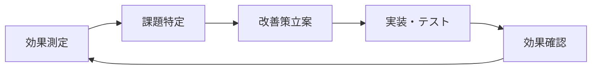

# 🏢 チーム導入ガイド：Cursor AI 知識管理システム（MDC形式対応版）

## 📋 概要

**Cursor AI公式の`.cursor/rules`形式（MDC）**を活用した知識管理システムのチーム導入ガイドです。チーム全体で最新のMDC形式システムを導入するための包括的なプロセスを提供します。

### 🆕 MDC形式の利点
- ✅ **公式サポート**: Cursor AI公式の`.cursor/rules`形式を採用
- ✅ **自動適用**: ファイルパターンに基づく条件付き自動適用
- ✅ **高度な制御**: description、globs、alwaysApplyによる柔軟な制御
- ✅ **チーム標準化**: 複数ルールによる段階的な標準化

---

## 🎯 チーム導入の目標

- **属人化解消**: 個人の知見をチーム全体で共有
- **自動化推進**: MDC形式による手動設定の削減
- **品質標準化**: 一貫したコード品質とベストプラクティス
- **開発スピード向上**: 自動適用機能によるチーム全体の生産性向上

---

## 📅 3段階導入プロセス（MDC対応版）

### Phase 1: MDC形式個人試用期間（2週間）

#### 目標
- 各メンバーがMDC形式システムを理解
- 自動適用機能の効果を実感
- チーム標準ルールの素案作成

#### 実施内容
- [ ] 全メンバーが個人プロジェクトでMDC形式を導入
- [ ] 4つのルールタイプ（Always/Auto/Agent/Manual）を体験
- [ ] プロジェクト固有のglobs パターンを発見
- [ ] 自動適用機能の効果を測定

#### 成果物
- MDC形式での使用感レポート
- プロジェクト固有のglobs パターン案
- チーム共通ルールの提案リスト

### Phase 2: チーム標準MDCルール策定期間（3週間）

#### 目標
- チーム共通のMDCルール策定
- 段階的な自動適用設定
- チーム運用プロセスの確立

#### Week 1: MDCルール設計
```markdown
- Phase 1の結果を統合
- チーム標準MDCルールの設計
- Always Rules（常時適用）の選定
```

#### Week 2: 試験運用
```markdown
- 標準MDCルールでの運用開始
- Auto Rules（自動適用）の調整
- Agent Rules（AI判断）の最適化
```

#### Week 3: ルール確定
```markdown
- MDCルールの最終調整
- チーム全体での合意形成
- 本格運用準備完了
```

### Phase 3: 本格運用・継続改善（継続）

#### 目標
- 安定したMDCルール運用の確立
- 継続的なルール改善サイクル
- 新しいMDC機能の活用

#### 実施内容
- [ ] 月次MDCルール見直し会の定期開催
- [ ] 四半期での自動適用効果測定
- [ ] 新メンバー向けMDC形式オンボーディング
- [ ] 他チームへのMDC知見共有

---

## 📝 チーム標準MDCルール設計

### 1. team-standards.mdc（Always Rules）

```yaml
---
description: "チーム開発における統一された標準とコーディング規約。常に適用される基本ルール。"
globs: "**/*"
alwaysApply: true
---

# チーム開発標準

## 基本方針
- **チーム知見優先**: @.cursor/knowledge.md でチーム知見を常に参照
- **標準パターン活用**: @.cursor/patterns.md でチーム標準を確認
- **即座記録**: 重要な解決策は必ず記録
- **レビュー必須**: 新しい知見は他メンバーのレビューを受ける

## コーディング規約
- **命名規則**: チーム統一の命名規則に従う
- **コメント**: 重要な判断は理由と決定者を明記
- **テスト**: 新機能には必ずテストを追加

## 記録ルール
- **問題解決**: 30分以上の調査は .cursor/debug/sessions/ に記録
- **設計判断**: アーキテクチャ決定は .cursor/knowledge.md に記録
- **パターン発見**: 新パターンは .cursor/patterns.md に即座追加
```

### 2. project-specific.mdc（Auto Rules）

```yaml
---
description: "プロジェクト固有の技術スタック用ルール。該当ファイル編集時に自動適用。"
globs: "**/*.{js,ts,jsx,tsx,py,java}"
alwaysApply: false
---

# プロジェクト固有ルール

## 技術スタック
- **言語**: [チームの使用言語]
- **フレームワーク**: [使用フレームワーク]
- **ライブラリ**: [主要ライブラリ]

## 開発ガイドライン
- 該当技術の既存パターンを @.cursor/patterns.md で確認
- 新しい実装前に @.cursor/knowledge.md で過去の技術判断を参照
- 問題発生時は @.cursor/debug/sessions/ で類似事例を検索
```

### 3. code-review.mdc（Agent Rules）

```yaml
---
description: "コードレビュー時に適用される品質管理ルール。AI判断で適用。"
globs: ""
alwaysApply: false
---

# コードレビュー品質管理

## レビュー観点
- **機能性**: 要件を満たしているか
- **可読性**: チームメンバーが理解できるか
- **保守性**: 将来の変更・拡張に対応できるか
- **一貫性**: チーム標準に準拠しているか

## チーム知見の活用
- 既存パターンとの整合性を @.cursor/patterns.md で確認
- 過去の類似実装を @.cursor/knowledge.md で参照
- 潜在的な問題を @.cursor/debug/sessions/ で予防
```

---

## 🔄 チーム運用プロセス（MDC対応版）

### 日常運用

#### 個人レベル
```markdown
1. 開発開始時
   - MDCルールが自動適用されることを確認
   - プロジェクト固有のルールが適用されているかチェック

2. 問題発生時  
   - @.cursor/debug/sessions/ で類似問題を自動検索
   - 解決後は即座に記録（MDCルールが記録を促進）

3. 新機能開発時
   - @.cursor/patterns.md でチーム標準パターンを自動参照
   - 新パターン発見時は即座に記録
```

#### チームレベル
```markdown
週次ミーティング（15分）:
- MDCルールの自動適用効果確認
- 新しく追加された重要な知見の共有

月次振り返り（1時間）:
- MDCルールの調整・最適化
- globs パターンの見直し
- Always/Auto/Agent Rulesの配分調整
```

### MDCルール管理

#### ルール更新フロー
```markdown
1. 個人での問題発見
   ↓
2. チーム内での議論
   ↓  
3. MDCルールの調整案作成
   ↓
4. 試験運用（1週間）
   ↓
5. 効果確認・本格適用
```

#### ルール品質管理
- [ ] **効果測定**: 自動適用による効率化を定量測定
- [ ] **パフォーマンス**: ルール数とCursor動作速度のバランス
- [ ] **使いやすさ**: メンバーの負担軽減効果
- [ ] **一貫性**: チーム全体での統一性確保

---

## 👥 ロール定義（MDC対応版）

### MDCルール管理者（持ち回り推奨）
- **責任**: MDCルールの品質管理、定期最適化の実施
- **任期**: 1-3ヶ月（プロジェクト規模に応じて）
- **業務**:
  - 月次MDCルール見直しの主導
  - globs パターンの最適化
  - 新メンバーへのMDC形式オンボーディング支援

### メンバー全員
- **責任**: MDCルールの効果的活用、改善提案
- **業務**:
  - 自動適用機能の積極的活用
  - MDCルール改善提案
  - 月次振り返りへの参加

---

## 📊 効果測定（MDC対応版）

### 測定指標の設定

#### 定量指標（MDC自動測定）
- **コンテキスト切り替え時間**: 削減を目標
- **重複作業の削減**: 削減を目標
- **新メンバーオンボーディング時間**: 短縮を目標

#### 定性指標（MDC効果）
- **開発集中度**: 手動設定による中断の削減
- **知識の一貫性**: チーム全体での統一性向上
- **AI活用効率**: 自動適用による効率化

### 測定方法

#### 月次MDCレポートテンプレート
```markdown
# チームMDC知識管理システム 月次レポート - [YYYY年MM月]

## MDCルール運用実績
- **Always Rules**: 適用回数 [回数]回、効果 [効果]
- **Auto Rules**: 自動適用 [回数]回、精度 [%]%
- **Agent Rules**: AI判断適用 [回数]回、満足度 [点数]/5点

## 効果測定
- **自動化率**: 手動設定 [%]% → 自動適用 [%]%
- **開発効率**: 前月比 [%]% 向上
- **チーム満足度**: [点数]/5点（MDC形式による）

## MDCルール改善
- **今月の調整**: [調整内容]
- **来月の目標**: [改善目標]
- **新機能活用**: [Cursor新機能の活用計画]
```

---

## 🚀 成功のポイント（MDC対応版）

### MDC導入成功要因
1. **段階的適用**: Always → Auto → Agent の順序で導入
2. **効果実感**: 自動適用による即座の効率化体験
3. **継続改善**: 定期的なglobs パターン最適化
4. **チーム合意**: MDCルールに対する全員の理解と合意

### よくある失敗パターンと対策（MDC版）

#### 失敗パターン1: ルールが複雑すぎる
**原因**: 最初から高度なMDCルールを設定
**対策**: 
- シンプルなAlways Rulesから開始
- 段階的にAuto/Agent Rulesを追加
- 定期的なルール見直しと簡素化

#### 失敗パターン2: 自動適用が期待通りに動かない
**原因**: globs パターンの設定ミス
**対策**:
- 具体的なファイルパスでテスト
- 段階的なパターン拡張
- チーム内でのパターン共有

#### 失敗パターン3: パフォーマンス低下
**原因**: 過度に複雑なMDCルール
**対策**:
- ルール数の適切な管理
- 重いルールの見直し
- Cursor設定の最適化

---

## 🔧 トラブルシューティング（MDC版）

### よくある問題

**Q: MDCルールが適用されない**
A: `.cursor/rules/`ディレクトリの場所とファイル拡張子（`.mdc`）を確認

**Q: 自動適用が働かない**
A: `globs`パターンとファイルパスが一致しているか確認

**Q: チーム内でルール適用にばらつきがある**
A: Cursor設定の統一とMDCルールの同期を確認

### 問題解決のアプローチ
- **技術的問題**: [完全版ガイド](../cursor-knowledge-management-system.md)参照
- **運用問題**: チーム内のMDCルール管理者との相談
- **チーム調整**: 定期的なMDCルール見直し会で解決

---

## 🔗 参考リソース

### 学習リソース
- **GitHub Issues**: バグ報告・機能要望の投稿
- **GitHub Discussions**: 使用方法・ベストプラクティスの共有
- **Cursor AI公式ドキュメント**: 最新機能の確認

### コミュニティ参加
- **成功事例の共有**: 他チームの参考になる事例の投稿
- **改善提案**: システムの改善アイデアの提案
- **質問・相談**: 導入・運用での疑問点の相談

---

**🚀 このシステムを活用して、効率的で持続可能なチーム知識管理を実現しましょう！** 

## ⚠️ **重要: 導入前の必須更新作業**

**GitHubからクローンした後、チーム導入前に以下のファイルは必ず更新が必要です：**

### 📝 **チーム導入で必須更新が必要なファイル**

#### プロジェクト基本情報
- [ ] `README.md` - チーム・プロジェクト名・概要・使用方法
- [ ] `package.json` - チームメタデータ（Node.jsの場合）

#### 🔥 **知識管理ファイル（最重要！）**
- [ ] `templates/.cursor/knowledge.md` - **チームの技術判断を記録**
- [ ] `templates/.cursor/patterns.md` - **チーム固有のパターンを記録**
- [ ] `templates/.cursor/context.md` - **プロジェクト背景・制約を記録**
- [ ] `templates/.cursor/debug-log.md` - **チームのデバッグ履歴を記録**
- [ ] `templates/.cursor/improvements.md` - **チームの改善履歴を記録**

#### チーム設定
- [ ] `.cursor/rules/team-rules/` 配下 - チーム開発ルール
- [ ] `.cursor/rules/global-rules/` - チーム標準ルール

### 🔒 **基本的に変更不要なファイル**
- `.cursor/rules/core-rules/rule-generating-agent.mdc` - ルール生成ロジック
- `.cursor/rules/ts-rules/`, `.cursor/rules/py-rules/` など（必要に応じて調整）

## 🚀 3段階導入プロセス

### 段階1: 基盤構築（1週間）

#### 1.1 環境セットアップ
```bash
# 1. リポジトリクローン
git clone https://github.com/your-team/cursor-knowledge-management-system.git
cd cursor-knowledge-management-system

# 2. チーム用ブランチ作成
git checkout -b team-setup

# 3. 必須ファイル更新（上記チェックリスト参照）
```

#### 1.2 チーム基本情報の設定

**templates/.cursor/context.md の更新例**
```markdown
# プロジェクト背景・制約（チーム名: プロジェクト名）

## チーム構成
- **プロジェクトマネージャー**: 田中太郎
- **フロントエンド**: 佐藤花子、鈴木次郎
- **バックエンド**: 山田三郎、高橋四郎
- **デザイナー**: 伊藤五郎

## プロジェクト概要
- **目的**: 社内業務効率化システムの構築
- **期間**: 6ヶ月（2025年6月〜12月）
- **予算**: 500万円

## 技術制約
- **フロントエンド**: React + TypeScript（チーム標準）
- **バックエンド**: Node.js + Express
- **データベース**: PostgreSQL
- **インフラ**: AWS（既存契約活用）
- **CI/CD**: GitHub Actions

## 品質基準
- **テストカバレッジ**: 80%以上
- **コードレビュー**: 必須（2名以上）
- **パフォーマンス**: First Contentful Paint < 2秒
```

#### 1.3 チーム開発ルールの策定

**templates/.cursor/patterns.md の更新例**
```markdown
# 設計パターン・実装テンプレート（チーム名: プロジェクト名）

## コーディング規約

### TypeScript/React
```typescript
// コンポーネント命名規則
interface Props {
  // props は必ず interface で定義
}

export const ComponentName: React.FC<Props> = ({ prop1, prop2 }) => {
  // 関数コンポーネントを使用
  return <div>{/* JSX */}</div>;
};
```

### API設計パターン
```typescript
// REST API レスポンス形式
interface ApiResponse<T> {
  success: boolean;
  data?: T;
  error?: string;
  timestamp: string;
}
```

## Git運用ルール
- **ブランチ命名**: feature/JIRA-123-description
- **コミットメッセージ**: [JIRA-123] feat: 機能追加の説明
- **プルリクエスト**: テンプレート必須、レビュー2名以上
```

### 段階2: チーム運用開始（2-3週間）

#### 2.1 役割分担の明確化

| 役割 | 担当者 | 責任範囲 |
|------|--------|----------|
| **知識管理リーダー** | 田中太郎 | knowledge.md の品質管理 |
| **パターン管理者** | 佐藤花子 | patterns.md の更新・レビュー |
| **デバッグ記録者** | 山田三郎 | debug-log.md の記録・分析 |
| **改善推進者** | 高橋四郎 | improvements.md の追跡・実行 |

#### 2.2 定期的な知識共有プロセス

**週次レビュー（毎週金曜日 16:00-17:00）**
```markdown
## 週次知識共有アジェンダ

### 1. 新しい技術判断の共有（10分）
- knowledge.md への新規追加内容
- 判断理由と影響範囲の説明

### 2. パターンの更新・追加（10分）
- patterns.md の新規パターン
- 既存パターンの改善提案

### 3. 問題・改善点の共有（15分）
- debug-log.md からの学習事項
- improvements.md の進捗確認

### 4. 次週の重点項目（10分）
- 優先的に記録すべき判断
- チーム全体で注意すべき点

### 5. MDCルールの調整（15分）
- 自動適用ルールの効果確認
- 新規ルールの必要性検討
```

#### 2.3 品質管理プロセス

**知識記録の品質基準**
```markdown
## 技術判断記録の必須項目

### 判断内容
- 何を決定したか（明確な表現）
- いつ決定したか（日付）
- 誰が決定したか（担当者）

### 検討プロセス
- 検討した選択肢（最低2つ）
- 各選択肢のメリット・デメリット
- 評価基準（性能、コスト、保守性など）

### 結果と理由
- 最終決定とその理由
- 想定されるリスクと対策
- 見直し条件（いつ再検討するか）

### 影響範囲
- 影響を受けるコンポーネント
- 関連する他の技術判断
- チームメンバーへの共有事項
```

### 段階3: 継続的改善（4週間目以降）

#### 3.1 効果測定と分析

**月次効果測定（毎月第1金曜日）**
```markdown
## 効果測定指標

### 開発効率
- [ ] プルリクエストの平均レビュー時間
- [ ] バグ修正にかかる平均時間
- [ ] 新機能開発の見積もり精度

### 知識共有効果
- [ ] 同じ問題の再発生率
- [ ] 新メンバーのオンボーディング時間
- [ ] 技術判断の一貫性スコア

### システム活用度
- [ ] knowledge.md の更新頻度
- [ ] patterns.md の参照回数
- [ ] MDCルールの自動適用率
```

#### 3.2 継続的な改善サイクル



**改善サイクルの具体例**
```markdown
## 改善サイクル実例

### 課題: コードレビューの品質にばらつき
#### 現状分析
- レビュー観点が人によって異なる
- patterns.md の参照率が低い

#### 改善策
1. レビューチェックリストの作成
2. patterns.md の自動参照ルール追加
3. レビュー品質の定量化

#### 実装
- .cursor/rules/review-rules.mdc の作成
- プルリクエストテンプレートの更新
- レビュー品質スコアの導入

#### 効果確認
- レビュー品質の向上
- レビュー時間の短縮
- チーム全体での品質向上
```

## 🎯 成功のためのベストプラクティス

### 1. 継続的な記録習慣
```markdown
## 記録のタイミング

### 即座に記録（リアルタイム）
- 重要な技術判断をした瞬間
- 新しいパターンを発見した時
- 問題解決に成功した時

### 定期的に記録（週次）
- 週次レビューでの振り返り
- パターンの整理・統合
- 改善点の洗い出し

### 計画的に記録（月次）
- 月次効果測定の結果
- 長期的な改善計画
- チーム全体の知識棚卸し
```

### 2. 効果的なMDCルール設計
```yaml
---
description: "チーム開発での品質管理ルール"
globs: "src/**/*.{ts,tsx}"
alwaysApply: true
---

# チーム品質管理ルール

## コードレビュー必須項目
1. セキュリティチェック
2. パフォーマンス影響確認
3. テストカバレッジ確認
4. ドキュメント更新確認

## 自動チェック項目
- ESLint/Prettier準拠
- 型安全性確認
- 命名規則準拠
- コメント記述率
```

### 3. チーム文化の醸成
```markdown
## 知識共有文化の醸成

### 心理的安全性の確保
- 失敗事例も積極的に共有
- 判断ミスを責めない文化
- 学習機会として捉える姿勢

### 継続的学習の推進
- 新技術の調査・共有
- 外部勉強会への参加奨励
- 社内勉強会の定期開催

### 成果の可視化
- 改善効果の定量的測定
- 成功事例の積極的な共有
- チーム外への成果発信
```

## 📊 導入効果の実例

### 導入前後の比較

| 指標 | 導入前 | 導入後 | 改善の方向性 |
|------|--------|--------|-------------|
| **バグ発生率** | 高い | 低い | 削減 |
| **コードレビュー時間** | 長い | 短い | 短縮 |
| **新人オンボーディング** | 長期間 | 短期間 | 短縮 |
| **技術判断の一貫性** | 低い | 高い | 向上 |
| **開発速度** | 遅い | 速い | 向上 |

*注: 具体的な数値は各チーム・プロジェクトの状況により異なります*

## 🔄 継続的な改善のための仕組み

### 1. 定期的な振り返り
```markdown
## 月次振り返りアジェンダ

### システム活用状況の確認（15分）
- 各ファイルの更新頻度
- MDCルールの適用状況
- チームメンバーの活用度

### 効果測定結果の共有（20分）
- KPI達成状況
- 改善効果の定量的評価
- 課題の特定と優先順位付け

### 改善計画の策定（20分）
- 次月の重点改善項目
- 具体的なアクションプラン
- 担当者と期限の設定

### ベストプラクティスの共有（5分）
- 他チームの成功事例
- 新しい活用方法の提案
- ツール・プロセスの改善提案
```

### 2. 知識の品質管理
```markdown
## 知識品質管理プロセス

### 記録時の品質チェック
- [ ] 5W1Hが明確に記載されている
- [ ] 他のメンバーが理解できる内容
- [ ] 再現可能な手順が記載されている
- [ ] 関連する他の記録との整合性

### 定期的な品質レビュー
- [ ] 古い情報の更新・削除
- [ ] 重複する内容の統合
- [ ] 分類・タグ付けの最適化
- [ ] 検索性の向上
```

## 🤝 コミュニティ・リソース

### 情報共有
- **GitHub Issues**: バグ報告・機能要望
- **GitHub Discussions**: 使用方法・ベストプラクティス共有
- **コミュニティ**: 他チームとの経験共有

### 学習リソース
- **ドキュメント**: 本プロジェクトの各種ガイド
- **Cursor AI公式**: 最新機能・アップデート情報
- **コミュニティ事例**: 他チームの導入事例・改善例

---

**⚠️ 重要**: チーム導入を成功させるには、`templates/.cursor/`内のファイルを実際のチーム・プロジェクト情報で更新することが必須です。テンプレートのままでは自動参照の効果が得られず、チーム全体での知識共有が実現できません。 