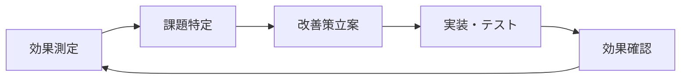

# 🏢 チーム導入ガイド：Cursor AI 知識管理システム（MDC形式対応版）

## 📋 概要

**Cursor AI公式の`.cursor/rules`形式（MDC）**を活用した知識管理システムのチーム導入ガイドです。チーム全体で最新のMDC形式システムを導入するための包括的なプロセスを提供します。

### 🆕 MDC形式の利点
- ✅ **公式サポート**: Cursor AI公式の`.cursor/rules`形式を採用
- ✅ **自動適用**: ファイルパターンに基づく条件付き自動適用
- ✅ **高度な制御**: description、globs、alwaysApplyによる柔軟な制御
- ✅ **チーム標準化**: 複数ルールによる段階的な標準化

---

## 🎯 チーム導入の目標

- **属人化解消**: 個人の知見をチーム全体で共有
- **自動化推進**: MDC形式による手動設定の削減
- **品質標準化**: 一貫したコード品質とベストプラクティス
- **開発スピード向上**: 自動適用機能によるチーム全体の生産性向上

---

## 🚀 3段階導入プロセス

### 段階1: 基盤構築

#### 1.1 環境セットアップ
```bash
# 1. リポジトリクローン
git clone https://github.com/your-team/cursor-knowledge-management-system.git
cd cursor-knowledge-management-system

# 2. チーム用ブランチ作成
git checkout -b team-setup

# 3. 必須ファイル更新（上記チェックリスト参照）
```

#### 1.2 チーム基本情報の設定

**templates/.cursor/context.md の更新例**
```markdown
# プロジェクト背景・制約（チーム名: プロジェクト名）

## チーム構成
- **プロジェクトマネージャー**: 田中太郎
- **フロントエンド**: 佐藤花子、鈴木次郎
- **バックエンド**: 山田三郎、高橋四郎
- **デザイナー**: 伊藤五郎

## プロジェクト概要
- **目的**: 社内業務効率化システムの構築
- **期間**: [実際のプロジェクト期間]
- **予算**: 500万円

## 技術制約
- **フロントエンド**: React + TypeScript（チーム標準）
- **バックエンド**: Node.js + Express
- **データベース**: PostgreSQL
- **インフラ**: AWS（既存契約活用）
- **CI/CD**: GitHub Actions

## 品質基準
- **テストカバレッジ**: 80%以上
- **コードレビュー**: 必須（2名以上）
- **パフォーマンス**: First Contentful Paint < 2秒
```

#### 1.3 チーム開発ルールの策定

**templates/.cursor/patterns.md の更新例**
```markdown
# 設計パターン・実装テンプレート（チーム名: プロジェクト名）

## コーディング規約

### TypeScript/React
```typescript
// コンポーネント命名規則
interface Props {
  // props は必ず interface で定義
}

export const ComponentName: React.FC<Props> = ({ prop1, prop2 }) => {
  // 関数コンポーネントを使用
  return <div>{/* JSX */}</div>;
};
```

### API設計パターン
```typescript
// REST API レスポンス形式
interface ApiResponse<T> {
  success: boolean;
  data?: T;
  error?: string;
  timestamp: string;
}
```

## Git運用ルール
- **ブランチ命名**: feature/JIRA-123-description
- **コミットメッセージ**: [JIRA-123] feat: 機能追加の説明
- **プルリクエスト**: テンプレート必須、レビュー2名以上
```

### 段階2: チーム運用開始

#### 2.1 役割分担の明確化

| 役割 | 担当者 | 責任範囲 |
|------|--------|----------|
| **知識管理リーダー** | 田中太郎 | knowledge.md の品質管理 |
| **パターン管理者** | 佐藤花子 | patterns.md の更新・レビュー |
| **デバッグ記録者** | 山田三郎 | debug-log.md の記録・分析 |
| **改善推進者** | 高橋四郎 | improvements.md の追跡・実行 |

#### 2.2 定期的な知識共有プロセス

**週次レビュー（毎週金曜日 16:00-17:00）**
```markdown
## 週次知識共有アジェンダ

### 1. 新しい技術判断の共有（10分）
- knowledge.md への新規追加内容
- 判断理由と影響範囲の説明

### 2. パターンの更新・追加（10分）
- patterns.md の新規パターン
- 既存パターンの改善提案

### 3. 問題・改善点の共有（15分）
- debug-log.md からの学習事項
- improvements.md の進捗確認

### 4. 次週の重点項目（10分）
- 優先的に記録すべき判断
- チーム全体で注意すべき点

### 5. MDCルールの調整（15分）
- 自動適用ルールの効果確認
- 新規ルールの必要性検討
```

#### 2.3 品質管理プロセス

**知識記録の品質基準**
```markdown
## 技術判断記録の必須項目

### 判断内容
- 何を決定したか（明確な表現）
- いつ決定したか（日付）
- 誰が決定したか（担当者）

### 検討プロセス
- 検討した選択肢（最低2つ）
- 各選択肢のメリット・デメリット
- 評価基準（性能、コスト、保守性など）

### 結果と理由
- 最終決定とその理由
- 想定されるリスクと対策
- 見直し条件（いつ再検討するか）

### 影響範囲
- 影響を受けるコンポーネント
- 関連する他の技術判断
- チームメンバーへの共有事項
```

### 段階3: 継続的改善

#### 3.1 効果測定と分析

**月次効果測定（毎月第1金曜日）**
```markdown
## 効果測定指標

### 開発効率
- [ ] プルリクエストの平均レビュー時間
- [ ] バグ修正にかかる平均時間
- [ ] 新機能開発の見積もり精度

### 知識共有効果
- [ ] 同じ問題の再発生率
- [ ] 新メンバーのオンボーディング時間
- [ ] 技術判断の一貫性スコア

### システム活用度
- [ ] knowledge.md の更新頻度
- [ ] patterns.md の参照回数
- [ ] MDCルールの自動適用率
```

#### 3.2 継続的な改善サイクル



**改善サイクルの具体例**
```markdown
## 改善サイクル実例

### 課題: コードレビューの品質にばらつき
#### 現状分析
- レビュー観点が人によって異なる
- patterns.md の参照率が低い

#### 改善策
1. レビューチェックリストの作成
2. patterns.md の自動参照ルール追加
3. レビュー品質の定量化

#### 実装
- .cursor/rules/review-rules.mdc の作成
- プルリクエストテンプレートの更新
- レビュー品質スコアの導入

#### 効果確認
- レビュー品質の向上
- レビュー時間の短縮
- チーム全体での品質向上
```

## 🎯 成功のためのベストプラクティス

### 1. 継続的な記録習慣
```markdown
## 記録のタイミング

### 即座に記録（リアルタイム）
- 重要な技術判断をした瞬間
- 新しいパターンを発見した時
- 問題解決に成功した時

### 定期的に記録（週次）
- 週次レビューでの振り返り
- パターンの整理・統合
- 改善点の洗い出し

### 計画的に記録（月次）
- 月次効果測定の結果
- 改善計画
- チーム全体の知識棚卸し
```

### 2. 効果的なMDCルール設計
```yaml
---
description: "チーム開発での品質管理ルール"
globs: "src/**/*.{ts,tsx}"
alwaysApply: true
---

# チーム品質管理ルール

## コードレビュー必須項目
1. セキュリティチェック
2. パフォーマンス影響確認
3. テストカバレッジ確認
4. ドキュメント更新確認

## 自動チェック項目
- ESLint/Prettier準拠
- 型安全性確認
- 命名規則準拠
- コメント記述率
```

### 3. チーム文化の醸成
```markdown
## 知識共有文化の醸成

### 心理的安全性の確保
- 失敗事例も積極的に共有
- 判断ミスを責めない文化
- 学習機会として捉える姿勢

### 継続的学習の推進
- 新技術の調査・共有
- 外部勉強会への参加奨励
- 社内勉強会の定期開催

### 成果の可視化
- 改善効果の定量的測定
- 成功事例の積極的な共有
- チーム外への成果発信
```

## 📊 導入効果の実例

### 導入前後の比較

| 指標 | 導入前 | 導入後 | 改善の方向性 |
|------|--------|--------|-------------|
| **バグ発生率** | 高い | 低い | 削減 |
| **コードレビュー時間** | 長い | 短い | 短縮 |
| **新人オンボーディング** | 長期間 | 短期間 | 短縮 |
| **技術判断の一貫性** | 低い | 高い | 向上 |
| **開発速度** | 遅い | 速い | 向上 |

*注: 具体的な数値は各チーム・プロジェクトの状況により異なります*

## 🔄 継続的な改善のための仕組み

### 1. 定期的な振り返り
```markdown
## 月次振り返りアジェンダ

### システム活用状況の確認（15分）
- 各ファイルの更新頻度
- MDCルールの適用状況
- チームメンバーの活用度

### 効果測定結果の共有（20分）
- KPI達成状況
- 改善効果の定量的評価
- 課題の特定と優先順位付け

### 改善計画の策定（20分）
- 次月の重点改善項目
- 具体的なアクションプラン
- 担当者と期限の設定

### ベストプラクティスの共有（5分）
- 他チームの成功事例
- 新しい活用方法の提案
- ツール・プロセスの改善提案
```

### 2. 知識の品質管理
```markdown
## 知識品質管理プロセス

### 記録時の品質チェック
- [ ] 5W1Hが明確に記載されている
- [ ] 他のメンバーが理解できる内容
- [ ] 再現可能な手順が記載されている
- [ ] 関連する他の記録との整合性

### 定期的な品質レビュー
- [ ] 古い情報の更新・削除
- [ ] 重複する内容の統合
- [ ] 分類・タグ付けの最適化
- [ ] 検索性の向上
```

## 🤝 コミュニティ・リソース

### 情報共有
- **GitHub Issues**: バグ報告・機能要望
- **GitHub Discussions**: 使用方法・ベストプラクティス共有
- **コミュニティ**: 他チームとの経験共有

### 学習リソース
- **ドキュメント**: 本プロジェクトの各種ガイド
- **Cursor AI公式**: 最新機能・アップデート情報
- **コミュニティ事例**: 他チームの導入事例・改善例

---

**⚠️ 重要**: チーム導入を成功させるには、`templates/.cursor/`内のファイルを実際のチーム・プロジェクト情報で更新することが必須です。テンプレートのままでは自動参照の効果が得られず、チーム全体での知識共有が実現できません。 