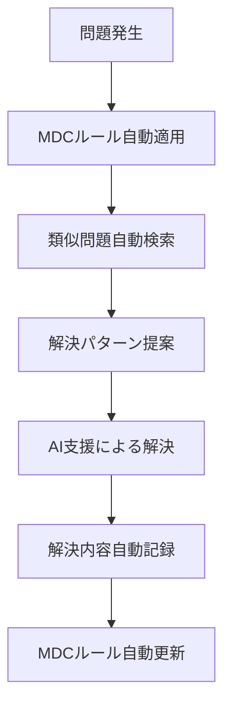

# デバッグ知見ログ（MDC対応版）

> **💡 MDC形式での活用**: このファイルは `.cursor/rules/debug-workflow.mdc` から自動参照されます。
> 問題発生時に、MDCルールが自動的に類似問題の解決例を提案し、解決後の記録も自動化されます。

## 記録基準（MDC自動化対応）
- 30分以上調査に時間がかかった問題
- 再発リスクが高い問題
- 他の人も遭遇しそうな問題
- 新しい技術やツールで発見した落とし穴
- 公式ドキュメントでは見つけにくい情報
- **MDC自動記録**: debug-workflow.mdcが自動的に記録を促進

---

## [日付] - [問題のタイトル]

### 問題概要
[問題の概要を簡潔に記述]

### 環境情報（MDC自動収集対応）
- **OS**: [Windows/macOS/Linux]
- **言語/フレームワーク**: [バージョン含む]
- **ツール**: [関連するツールとバージョン]
- **Cursor設定**: [MDCルール適用状況]
- **その他**: [関連する環境情報]

### MDC支援状況
- **自動検索結果**: @.cursor/debug/sessions/ での類似問題検索結果
- **適用されたMDCルール**: [自動適用されたデバッグルール]
- **AI提案**: [Cursor AIによる自動提案内容]

### 調査手順（MDC連携版）
1. [最初に試したこと]
   - **MDC支援**: [関連するMDCルールの提案]
2. [次に調査したこと]
   - **過去事例参照**: @.cursor/debug/sessions/ での類似事例
3. [最終的に見つけた解決方法]
   - **パターン適用**: @.cursor/patterns.md での解決パターン活用

### 発見した事実
[調査で分かったことを記述]
- **原因**: 
- **なぜ起きたか**: 
- **関連する仕様や制約**: @.cursor/context.md での制約確認結果
- **MDC改善点**: [今回の問題を受けたMDCルール改善提案]

### 解決策（MDC統合版）
```
[解決に使ったコードやコマンドを記述]
# このパターンは今後 [技術名]-patterns.mdc に自動追加される
```

### 所要時間（MDC効果測定）
- **総調査時間**: [調査・解決にかかった時間]
- **MDC支援効果**: [MDCルールによる時間短縮効果]
- **従来比較**: [MDC未使用時との比較]

### 再発防止策（MDC自動化）
[同じ問題を避けるための対策]
- **MDCルール追加**: [新規作成するMDCルール]
- **既存ルール改善**: [改善するMDCルール]
- **自動チェック**: [今後の自動検出方法]
- **チーム共有**: [team-standards.mdcへの反映内容]

### 関連情報（MDC連携）
[参考リンクや関連ドキュメント]
- **公式ドキュメント**: 
- **Stack Overflow**: 
- **GitHub Issues**: 
- **MDC知見**: @.cursor/knowledge.md での関連技術判断
- **パターン**: @.cursor/patterns.md での関連パターン

### MDC自動更新
- **patterns.md更新**: [追加される解決パターン]
- **knowledge.md更新**: [追加される技術知見]
- **新MDCルール**: [作成予定のMDCルール]

### タグ（MDC検索最適化）
`#[技術名]` `#[問題カテゴリ]` `#[重要度]` `#MDC対応` `#自動解決可能`

---

## テンプレート（コピー用・MDC対応版）

```markdown
## [日付] - [問題のタイトル]

### 問題概要
[問題の概要を簡潔に記述]

### 環境情報（MDC自動収集対応）
- **OS**: 
- **言語/フレームワーク**: 
- **ツール**: 
- **Cursor設定**: 
- **その他**: 

### MDC支援状況
- **自動検索結果**: 
- **適用されたMDCルール**: 
- **AI提案**: 

### 調査手順（MDC連携版）
1. 
   - **MDC支援**: 
2. 
   - **過去事例参照**: 
3. 
   - **パターン適用**: 

### 発見した事実
- **原因**: 
- **なぜ起きたか**: 
- **関連する仕様や制約**: 
- **MDC改善点**: 

### 解決策（MDC統合版）
```
[解決に使ったコードやコマンドを記述]
```

### 所要時間（MDC効果測定）
- **総調査時間**: 
- **MDC支援効果**: 
- **従来比較**: 

### 再発防止策（MDC自動化）
- **MDCルール追加**: 
- **既存ルール改善**: 
- **自動チェック**: 
- **チーム共有**: 

### 関連情報（MDC連携）
- **公式ドキュメント**: 
- **MDC知見**: 
- **パターン**: 

### MDC自動更新
- **patterns.md更新**: 
- **knowledge.md更新**: 
- **新MDCルール**: 

### タグ（MDC検索最適化）
`#[技術名]` `#[問題カテゴリ]` `#[重要度]` `#MDC対応`
```

---

## 問題分類例（MDC対応版）

### カテゴリ別タグ（MDC自動分類）
- `#環境構築` - 開発環境セットアップ関連
  - **MDC対応**: setup-patterns.mdcで自動化
- `#依存関係` - パッケージやライブラリの問題
  - **MDC対応**: dependency-patterns.mdcで自動解決
- `#パフォーマンス` - 速度・メモリ関連の問題
  - **MDC対応**: performance-patterns.mdcで自動最適化
- `#セキュリティ` - セキュリティ関連の問題
  - **MDC対応**: security-patterns.mdcで自動チェック
- `#デプロイ` - デプロイメント関連の問題
  - **MDC対応**: deploy-patterns.mdcで自動化
- `#テスト` - テスト実行・作成関連
  - **MDC対応**: test-patterns.mdcで自動化
- `#API` - API連携の問題
  - **MDC対応**: api-patterns.mdcで自動解決
- `#データベース` - DB関連の問題
  - **MDC対応**: database-patterns.mdcで自動最適化
- `#UI/UX` - フロントエンド関連の問題
  - **MDC対応**: frontend-patterns.mdcで自動解決

### 重要度別タグ（MDC優先度）
- `#緊急` - システム停止レベル
  - **MDC対応**: 最高優先度でAI支援提供
- `#高` - 機能に大きな影響
  - **MDC対応**: 高優先度でパターン提案
- `#中` - 一部機能に影響
  - **MDC対応**: 標準的なAI支援
- `#低` - 軽微な問題
  - **MDC対応**: 基本的なパターン提案

### MDC自動解決レベル
- `#自動解決可能` - MDCルールで完全自動解決
- `#半自動解決` - MDCルール + 手動調整で解決
- `#手動解決必要` - MDCルールは支援のみ、手動解決必要
- `#新規パターン` - 新しいMDCルール作成が必要

---

## MDC統合デバッグワークフロー

### 問題発生時の自動フロー


### デバッグセッション管理（MDC版）
```
.cursor/debug/sessions/
├── YYYY-MM-DD_[問題カテゴリ]_[連番].md
├── archive/                    # 解決済み問題のアーカイブ
└── temp-logs/                  # 一時的なデバッグログ
```

### 自動記録トリガー
- **30分経過**: 自動的に記録テンプレートを提案
- **解決完了**: 解決内容の自動記録を促進
- **パターン発見**: 新パターンの自動抽出・分類
- **MDCルール更新**: 関連ルールの自動更新提案

## 効果測定（MDC版）

### 月次デバッグ効率レポート
```markdown
## [YYYY年MM月] MDCデバッグ効率レポート

### 問題解決実績
- **総問題数**: [件数]件
- **MDC自動解決**: [件数]件（[%]%）
- **MDC支援解決**: [件数]件（[%]%）
- **手動解決**: [件数]件（[%]%）

### 時間効率
- **平均解決時間**: [時間]（前月比[±%]%）
- **MDC支援効果**: [短縮時間]時間/件
- **累積時間短縮**: [総短縮時間]時間

### MDCルール効果
- **新規ルール追加**: [件数]件
- **既存ルール改善**: [件数]件
- **自動適用成功率**: [%]%

### 知見蓄積
- **新規パターン**: [件数]件
- **技術知見追加**: [件数]件
- **チーム共有**: [件数]件
```

### 継続改善指標
- **再発防止率**: 同じ問題の再発頻度
- **MDC精度向上**: 自動提案の的中率
- **チーム効率**: チーム全体での解決時間短縮
- **知見活用率**: 過去知見の参照・活用頻度

---

## よくある問題パターン（MDC自動解決対応）

### 1. 環境構築問題
**問題パターン**: [具体的な問題]
**MDC自動解決**: setup-patterns.mdcによる自動解決手順
**成功率**: [%]%

### 2. 依存関係問題
**問題パターン**: [具体的な問題]
**MDC自動解決**: dependency-patterns.mdcによる自動解決
**成功率**: [%]%

### 3. パフォーマンス問題
**問題パターン**: [具体的な問題]
**MDC自動解決**: performance-patterns.mdcによる自動最適化
**成功率**: [%]%

---

> **🚀 MDC形式の利点**: 
> - **自動検索**: 問題発生時に類似事例を自動検索・提案
> - **解決支援**: 過去のパターンに基づく自動的な解決支援
> - **記録自動化**: 解決プロセスの自動的な構造化記録
> - **継続改善**: 解決パターンの自動抽出・MDCルール更新
> - **チーム共有**: 重要な解決策の自動的なチーム共有
> - **予防効果**: 類似問題の事前防止・早期発見 