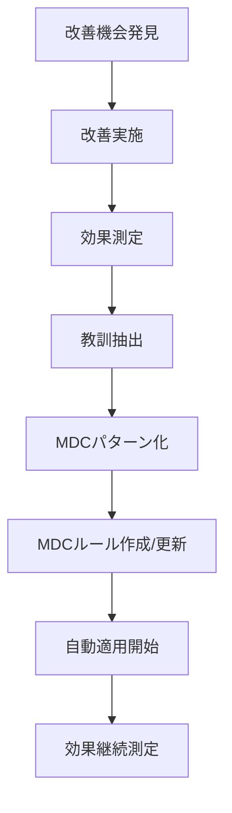

# 改善履歴・教訓（MDC対応版）

> **💡 MDC形式での活用**: このファイルは `.cursor/rules/team-standards.mdc` から自動参照されます。
> 改善事例が、MDCルールにより自動的に類似状況での改善提案に活用されます。

## 記録目的（MDC統合版）
- 失敗から学んだ教訓の蓄積
- 改善プロセスの可視化
- 同じ間違いの再発防止
- チーム全体での学習促進
- 継続的改善文化の醸成
- **MDC自動活用**: 類似状況での自動的な改善提案
- **パターン化**: 改善手法の自動的なパターン抽出

---

## [日付] - [改善内容のタイトル]

### 改善内容
[実施した改善内容を記述]

### 背景・問題（MDC連携）
[なぜこの改善が必要だったのか]
- **発生した問題**: 
- **影響範囲**: 
- **根本原因**: 
- **MDC分析**: @.cursor/debug/sessions/ での類似問題分析結果
- **コンテキスト**: @.cursor/context.md での制約・要件との関連

### 実施した対策（MDC統合版）
[具体的に何をしたか]
1. **技術的対策**: 
   - **MDC支援**: [適用されたMDCパターン]
2. **プロセス改善**: 
   - **MDC統合**: [新規作成・改善されたMDCルール]
3. **チーム対応**: 
   - **MDC共有**: [team-standards.mdcへの反映内容]

### 結果・効果（MDC効果測定）
[改善の効果を記述]
- **定量的効果**: [数値で測定可能な効果]
  - **MDC自動化効果**: [MDCルールによる自動化効果]
- **定性的効果**: [品質向上等の効果]
  - **MDC一貫性効果**: [チーム全体での一貫性向上]
- **副次的効果**: [予期しなかった良い効果]
  - **MDC波及効果**: [他の領域への波及効果]

### 学んだ教訓（MDC活用版）
[今回の経験から得られた教訓]
- **技術的教訓**: 
  - **MDCパターン化**: [patterns.mdに追加される教訓]
- **プロセス教訓**: 
  - **MDCルール化**: [新規MDCルールとして活用]
- **チーム教訓**: 
  - **MDC標準化**: [team-standards.mdcへの反映]

### 今後の展開（MDC自動化）
[さらなる改善予定や関連する改善計画]
- **技術展開**: 
  - **MDC自動適用**: [関連技術での自動適用計画]
- **プロセス展開**: 
  - **MDCルール拡張**: [他プロセスへのルール適用]
- **チーム展開**: 
  - **MDC知見共有**: [他チームへの知見共有計画]

### 測定指標（MDC統合測定）
[改善効果を継続的に測定する指標]
- **従来指標**: 
- **MDC効果指標**: [MDCルールによる自動化効果測定]
- **チーム指標**: [チーム全体での改善効果測定]

### MDC自動更新
- **patterns.md更新**: [追加される改善パターン]
- **knowledge.md更新**: [追加される技術知見]
- **新MDCルール**: [作成予定のMDCルール]
- **既存ルール改善**: [改善されるMDCルール]

### タグ（MDC検索最適化）
`#[改善カテゴリ]` `#[技術領域]` `#[影響度]` `#MDC対応` `#自動化可能`

---

## テンプレート（コピー用・MDC対応版）

```markdown
## [日付] - [改善内容のタイトル]

### 改善内容
[実施した改善内容を記述]

### 背景・問題（MDC連携）
- **発生した問題**: 
- **影響範囲**: 
- **根本原因**: 
- **MDC分析**: 
- **コンテキスト**: 

### 実施した対策（MDC統合版）
1. **技術的対策**: 
   - **MDC支援**: 
2. **プロセス改善**: 
   - **MDC統合**: 
3. **チーム対応**: 
   - **MDC共有**: 

### 結果・効果（MDC効果測定）
- **定量的効果**: 
  - **MDC自動化効果**: 
- **定性的効果**: 
  - **MDC一貫性効果**: 
- **副次的効果**: 
  - **MDC波及効果**: 

### 学んだ教訓（MDC活用版）
- **技術的教訓**: 
  - **MDCパターン化**: 
- **プロセス教訓**: 
  - **MDCルール化**: 
- **チーム教訓**: 
  - **MDC標準化**: 

### 今後の展開（MDC自動化）
- **技術展開**: 
  - **MDC自動適用**: 
- **プロセス展開**: 
  - **MDCルール拡張**: 
- **チーム展開**: 
  - **MDC知見共有**: 

### 測定指標（MDC統合測定）
- **従来指標**: 
- **MDC効果指標**: 
- **チーム指標**: 

### MDC自動更新
- **patterns.md更新**: 
- **knowledge.md更新**: 
- **新MDCルール**: 
- **既存ルール改善**: 

### タグ（MDC検索最適化）
`#[改善カテゴリ]` `#[技術領域]` `#[影響度]` `#MDC対応`
```

---

## アンチパターン集（MDC自動防止版）

### 1. 技術的アンチパターン（MDC自動検出）
**パターン**: [問題のあるパターンの説明]
**問題**: [なぜ問題なのか]
**解決策**: [推奨するアプローチ]
**例**: [具体例]
**MDC防止**: [該当するMDCルールによる自動防止方法]
**自動検出**: code-quality.mdcによる自動検出・警告

### 2. プロセス的アンチパターン（MDC自動改善）
**パターン**: [問題のあるプロセス]
**問題**: [どのような問題を引き起こすか]
**解決策**: [改善されたプロセス]
**例**: [具体例]
**MDC改善**: [該当するMDCルールによる自動プロセス改善]
**自動適用**: workflow-patterns.mdcによる自動適用

### 3. コミュニケーション・アンチパターン（MDC自動支援）
**パターン**: [問題のあるコミュニケーション]
**問題**: [どのような問題を引き起こすか]
**解決策**: [改善されたコミュニケーション方法]
**例**: [具体例]
**MDC支援**: [該当するMDCルールによる自動コミュニケーション支援]
**自動促進**: team-collaboration.mdcによる自動促進

---

## 成功パターン集（MDC自動適用版）

### 1. 効果的な問題解決パターン（MDC自動化）
**パターン**: [成功したアプローチ]
**効果**: [どのような効果があったか]
**適用条件**: [どのような状況で有効か]
**注意点**: [使用時の注意事項]
**MDC自動化**: [該当するMDCルールによる自動適用]
**成功率**: [MDC適用時の成功率]

### 2. 効率的な開発パターン（MDC統合版）
**パターン**: [効率的な開発手法]
**効果**: [生産性向上の効果]
**適用条件**: [どのような場面で有効か]
**注意点**: [注意すべき点]
**MDC統合**: [該当するMDCルールによる自動統合]
**効率化率**: [MDC統合による効率化率]

### 3. チーム連携パターン（MDC自動促進版）
**パターン**: [効果的なチーム連携方法]
**効果**: [チームワーク向上の効果]
**適用条件**: [どのようなチーム構成で有効か]
**注意点**: [留意すべき点]
**MDC促進**: [該当するMDCルールによる自動促進]
**連携効果**: [MDC促進による連携効果]

---

## 改善分類例（MDC対応版）

### カテゴリ別タグ（MDC自動分類）
- `#プロセス改善` - 開発プロセスの改善
  - **MDC対応**: workflow-patterns.mdcで自動化
- `#技術改善` - 技術的な改善・最適化
  - **MDC対応**: tech-optimization.mdcで自動最適化
- `#品質改善` - コード品質・テスト品質の向上
  - **MDC対応**: quality-patterns.mdcで自動品質向上
- `#コミュニケーション改善` - チーム内外のコミュニケーション改善
  - **MDC対応**: communication-patterns.mdcで自動改善
- `#効率化` - 作業効率・生産性の向上
  - **MDC対応**: efficiency-patterns.mdcで自動効率化
- `#ツール改善` - 開発ツール・環境の改善
  - **MDC対応**: tool-optimization.mdcで自動最適化
- `#セキュリティ改善` - セキュリティ関連の改善
  - **MDC対応**: security-patterns.mdcで自動セキュリティ向上
- `#パフォーマンス改善` - システム性能の改善
  - **MDC対応**: performance-patterns.mdcで自動最適化

### 影響度別タグ（MDC優先度）
- `#全体影響` - プロジェクト全体に影響
  - **MDC対応**: 最高優先度でMDCルール適用
- `#チーム影響` - チーム内に影響
  - **MDC対応**: 高優先度でMDCルール適用
- `#個人影響` - 個人レベルの改善
  - **MDC対応**: 標準優先度でMDCルール適用
- `#長期影響` - 長期的な効果
  - **MDC対応**: 継続的なMDCルール最適化
- `#即効性` - 即座に効果が現れる
  - **MDC対応**: 即座のMDCルール適用

### 技術領域別タグ（MDC専用ルール）
- `#フロントエンド` - UI/UX、クライアントサイド
  - **MDC対応**: frontend-improvements.mdc
- `#バックエンド` - サーバーサイド、API
  - **MDC対応**: backend-improvements.mdc
- `#インフラ` - サーバー、ネットワーク、クラウド
  - **MDC対応**: infrastructure-improvements.mdc
- `#データベース` - DB設計、クエリ最適化
  - **MDC対応**: database-improvements.mdc
- `#テスト` - テスト戦略、自動化
  - **MDC対応**: test-improvements.mdc
- `#デプロイ` - CI/CD、リリース管理
  - **MDC対応**: deploy-improvements.mdc

### MDC自動化レベル
- `#完全自動化` - MDCルールで完全自動化可能
- `#半自動化` - MDCルール + 手動調整で自動化
- `#支援自動化` - MDCルールが改善を支援
- `#手動改善` - MDCルールは参考のみ、手動改善必要

---

## 定期振り返りテンプレート（MDC統合版）

### 月次振り返り（MDC効果測定）
```markdown
## [YYYY年MM月] MDC改善振り返り

### 今月の主要改善
1. [改善項目1] - [効果] - [MDC自動化状況]
2. [改善項目2] - [効果] - [MDC自動化状況]
3. [改善項目3] - [効果] - [MDC自動化状況]

### 数値での改善効果（MDC統合測定）
- **開発効率**: [前月比 ±X%] - MDC自動化効果: [±X%]
- **バグ発生率**: [前月比 ±X%] - MDC予防効果: [±X%]
- **レビュー時間**: [前月比 ±X分/件] - MDC支援効果: [±X分/件]
- **知見活用率**: [前月比 ±X%] - MDC自動参照効果: [±X%]

### MDCルール効果
- **新規ルール追加**: [件数]件
- **既存ルール改善**: [件数]件
- **自動適用成功率**: [%]%
- **改善パターン抽出**: [件数]件

### 新たに発見された課題（MDC対応計画）
- [課題1] - MDC対応計画: [対応予定のMDCルール]
- [課題2] - MDC対応計画: [対応予定のMDCルール]

### 来月の改善目標（MDC統合版）
- [目標1] - MDC自動化計画: [計画内容]
- [目標2] - MDC自動化計画: [計画内容]
```

### 四半期振り返り（MDC戦略見直し）
```markdown
## [YYYY年QX] MDC改善戦略振り返り

### MDC統合効果
- **自動化達成率**: [%]%
- **改善効果向上**: [前四半期比 ±X%]
- **チーム満足度**: [点数]/5点

### MDCルール最適化
- **ルール統合**: [統合件数]件
- **ルール削除**: [削除件数]件
- **新機能活用**: [活用した新機能]

### 次四半期戦略
- **重点改善領域**: [領域名]
- **MDC新機能活用**: [活用予定の機能]
- **チーム展開**: [他チームへの展開計画]
```

---

## MDC改善ワークフロー

### 改善発見から自動化まで


### 改善の自動共有フロー
1. **改善記録**: improvements.mdに記録
2. **パターン抽出**: MDCルールが自動的にパターンを抽出
3. **ルール更新**: 関連MDCルールの自動更新
4. **チーム適用**: team-standards.mdcによる自動適用
5. **効果測定**: 自動的な効果測定・レポート

---

## 継続的改善指標（MDC版）

### 改善効率指標
- **改善実施率**: 発見された改善機会の実施率
- **MDC自動化率**: 改善のMDC自動化達成率
- **効果持続率**: 改善効果の持続性
- **チーム浸透率**: チーム全体での改善浸透度

### MDC統合効果指標
- **自動適用精度**: MDCルールの自動適用精度
- **改善提案的中率**: MDCによる改善提案の的中率
- **知見活用率**: 過去改善事例の活用頻度
- **パターン抽出率**: 改善からのパターン抽出成功率

---

> **🚀 MDC形式の利点**: 
> - **自動パターン化**: 改善事例の自動的なパターン抽出・分類
> - **継続適用**: 改善手法の自動的な継続適用
> - **予防効果**: アンチパターンの自動的な事前防止
> - **チーム共有**: 改善知見の自動的なチーム共有
> - **効果測定**: 改善効果の自動的な継続測定
> - **進化促進**: 改善手法の自動的な進化・最適化 